# Architecture: Block Agent System

**Version**: 2.0.0 | **Date**: 2025-12-09 | **Status**: Draft

> 로직 무결성과 앱 관리 최적화를 위한 블럭화 + 에이전트 시스템 아키텍처

---

## 목차

1. [개요](#1-개요)
   - 1.1 목적
   - 1.2 설계 원칙
   - 1.3 아키텍처 개요
   - **1.4 AI 컨텍스트 최적화** ← NEW
2. [블럭 정의](#2-블럭-정의)
   - 2.1 블럭 구조
   - 2.2 도메인별 블럭 맵
   - 2.3 블럭 의존성 그래프
   - **2.4 Vertical Slicing 패턴** ← NEW
   - **2.5 블럭 사이즈 가이드** ← NEW
3. [에이전트 시스템](#3-에이전트-시스템)
   - 3.1 에이전트 계층 구조
   - 3.2 에이전트 인터페이스
   - 3.3 도메인 에이전트 상세
   - 3.4 에이전트-블럭 매핑 테이블
   - **3.5 Agent Rules 파일** ← NEW
4. [오케스트레이션 패턴](#4-오케스트레이션-패턴)
   - 4.1 채택 패턴
   - 4.2 워크플로우 예시
   - 4.3 병렬 처리 패턴
   - **4.4 Conductor 워크플로우** ← NEW
5. [통신 프로토콜](#5-통신-프로토콜)
6. [에러 처리 및 복구](#6-에러-처리-및-복구)
7. [구현 가이드](#7-구현-가이드)

---

## 1. 개요

### 1.1 목적

| 목표 | 설명 |
|------|------|
| **로직 무결성** | 블럭 간 명확한 경계로 부작용(Side Effect) 격리 |
| **관리 최적화** | 블럭별 전담 에이전트로 책임 분리 |
| **확장성** | 새 블럭/에이전트 추가 시 기존 시스템 영향 최소화 |
| **디버깅 용이성** | 문제 발생 시 해당 블럭/에이전트만 분석 |

### 1.2 설계 원칙

```
┌─────────────────────────────────────────────────────────────┐
│                    DESIGN PRINCIPLES                         │
├─────────────────────────────────────────────────────────────┤
│  1. Single Responsibility  - 하나의 블럭은 하나의 관심사     │
│  2. Loose Coupling         - 블럭 간 인터페이스로만 통신     │
│  3. High Cohesion          - 블럭 내부는 강하게 결합        │
│  4. Fail Fast              - 에러는 즉시 감지, 빠르게 복구  │
│  5. Observable             - 모든 블럭 상태는 관찰 가능     │
└─────────────────────────────────────────────────────────────┘
```

### 1.3 아키텍처 개요

```
                         ┌─────────────────┐
                         │  Orchestrator   │
                         │     Agent       │
                         └────────┬────────┘
                                  │
           ┌──────────────────────┼──────────────────────┐
           │                      │                      │
           ▼                      ▼                      ▼
    ┌─────────────┐       ┌─────────────┐       ┌─────────────┐
    │   Domain    │       │   Domain    │       │   Domain    │
    │   Agent     │       │   Agent     │       │   Agent     │
    │  (Auth)     │       │  (Content)  │       │  (Stream)   │
    └──────┬──────┘       └──────┬──────┘       └──────┬──────┘
           │                      │                      │
    ┌──────┴──────┐       ┌──────┴──────┐       ┌──────┴──────┐
    │   Blocks    │       │   Blocks    │       │   Blocks    │
    ├─────────────┤       ├─────────────┤       ├─────────────┤
    │ • Validate  │       │ • Query     │       │ • Transcode │
    │ • Token     │       │ • Search    │       │ • Deliver   │
    │ • Session   │       │ • Cache     │       │ • Monitor   │
    └─────────────┘       └─────────────┘       └─────────────┘
```

### 1.4 AI 컨텍스트 최적화

블럭화가 필요한 기술적 근거입니다.

#### 1.4.1 문제 진단

앱의 볼륨이 커질수록 AI의 퍼포먼스가 급락하는 현상은 **기술적 한계**에 기인합니다:

```
┌─────────────────────────────────────────────────────────────┐
│                    AI BOTTLENECKS                            │
├─────────────────────────────────────────────────────────────┤
│                                                              │
│  1. Context Pollution (컨텍스트 오염)                        │
│     ────────────────────────────────────────────────────     │
│     무관한 코드가 AI의 추론을 방해합니다.                     │
│     프론트엔드 작업 시 백엔드 설정 파일이 노이즈가 되어       │
│     환각(Hallucination)을 유발합니다.                        │
│                                                              │
│  2. Attention Dilution (주의력 분산)                         │
│     ────────────────────────────────────────────────────     │
│     최신 LLM이 1M 토큰을 처리한다고 해도, '집중력'은          │
│     입력량이 늘어날수록 떨어집니다.                           │
│     (Lost-in-the-Middle 현상)                                │
│                                                              │
│  3. Scale Threshold (규모 임계점)                            │
│     ────────────────────────────────────────────────────     │
│     "전체를 다 보고 알아서 고쳐줘" 방식은                     │
│     파일 50개+ 규모부터 사실상 불가능합니다.                  │
│                                                              │
└─────────────────────────────────────────────────────────────┘
```

#### 1.4.2 블럭화 효과

| Before (단일 컨텍스트) | After (블럭화) |
|------------------------|----------------|
| 전체 코드베이스 로드 (500+ 파일) | 해당 블럭만 로드 (15~30 파일) |
| 무관한 코드로 인한 환각 | 관련 코드만 집중 분석 |
| AI 응답 시간 10초+ | AI 응답 시간 2~3초 |
| 오류율 높음 | 오류율 현저히 감소 |

```
                    AI Performance vs Codebase Size

    Error Rate
    │
    │                                      ╱ Without Blocks
    │                                   ╱
    │                                ╱
    │                             ╱
    │                          ╱
    │                       ╱
    │                    ╱
    │                 ╱───────────────── With Blocks
    │              ╱ ╱
    │           ╱  ╱
    │        ╱   ╱
    │     ╱    ╱
    │  ╱     ╱
    │╱──────┴──────────────────────────────────────
    └──────────────────────────────────────────────▶
         50      100     200     500    1000   Files
              ↑
         Threshold
         (블럭화 권장 시점)
```

---

## 2. 블럭 정의

### 2.1 블럭 구조

블럭은 WSOPTV Monorepo의 패키지 구조를 기반으로 정의됩니다.

```typescript
// types/block.ts
interface Block {
  id: string;                    // 'auth.validate', 'content.query'
  domain: DomainType;            // 'auth' | 'content' | 'stream' | 'search'
  name: string;                  // 'validate', 'query', 'transcode'
  version: string;               // SemVer
  status: BlockStatus;

  // 의존성
  inputs: InputPort[];
  outputs: OutputPort[];

  // 메타데이터
  metadata: {
    description: string;
    owner: string;               // 담당 에이전트 ID
    tags: string[];
    createdAt: string;
    updatedAt: string;
  };
}

type DomainType = 'auth' | 'content' | 'stream' | 'search' | 'player' | 'admin';
type BlockStatus = 'idle' | 'processing' | 'error' | 'disabled';

interface InputPort {
  name: string;
  type: string;                  // TypeScript 타입 문자열
  required: boolean;
  validator?: string;            // Zod 스키마 참조
}

interface OutputPort {
  name: string;
  type: string;
  emitsOn: 'success' | 'error' | 'always';
}
```

### 2.2 도메인별 블럭 맵

#### Auth Domain

```
┌─────────────────────────────────────────────────────────────┐
│                     AUTH DOMAIN                              │
├─────────────────────────────────────────────────────────────┤
│                                                              │
│  ┌──────────────┐    ┌──────────────┐    ┌──────────────┐  │
│  │   validate   │───▶│    token     │───▶│   session    │  │
│  │    Block     │    │    Block     │    │    Block     │  │
│  └──────────────┘    └──────────────┘    └──────────────┘  │
│         │                   │                   │          │
│         ▼                   ▼                   ▼          │
│  • 입력 검증          • JWT 발급           • 세션 관리     │
│  • Zod 스키마         • Refresh 처리       • Redis 저장    │
│  • Rate Limit         • Blacklist          • 만료 처리     │
│                                                              │
└─────────────────────────────────────────────────────────────┘
```

| Block ID | 책임 | 입력 | 출력 |
|----------|------|------|------|
| `auth.validate` | 인증 정보 검증 | `LoginRequest` | `ValidatedCredentials` |
| `auth.token` | JWT 생성/갱신/검증 | `ValidatedCredentials` | `TokenPair` |
| `auth.session` | 세션 상태 관리 | `TokenPair` | `SessionState` |

#### Content Domain

```
┌─────────────────────────────────────────────────────────────┐
│                    CONTENT DOMAIN                            │
├─────────────────────────────────────────────────────────────┤
│                                                              │
│  ┌──────────────┐    ┌──────────────┐    ┌──────────────┐  │
│  │    query     │───▶│    cache     │───▶│   response   │  │
│  │    Block     │    │    Block     │    │    Block     │  │
│  └──────────────┘    └──────────────┘    └──────────────┘  │
│         │                   │                   │          │
│         ▼                   ▼                   ▼          │
│  • DB 조회             • Redis 캐시        • 직렬화       │
│  • Eager Loading       • TTL 관리          • 페이지네이션  │
│  • 필터/정렬           • 무효화            • 하이퍼미디어  │
│                                                              │
│  ┌──────────────┐    ┌──────────────┐                      │
│  │    hands     │───▶│   timeline   │                      │
│  │    Block     │    │    Block     │                      │
│  └──────────────┘    └──────────────┘                      │
│         │                   │                              │
│         ▼                   ▼                              │
│  • 핸드 데이터         • 타임라인 구축                     │
│  • 등급 필터           • 인덱스 생성                       │
│                                                              │
└─────────────────────────────────────────────────────────────┘
```

| Block ID | 책임 | 입력 | 출력 |
|----------|------|------|------|
| `content.query` | 콘텐츠 조회 로직 | `ContentQuery` | `RawContent[]` |
| `content.cache` | 캐시 계층 관리 | `CacheKey` | `CachedData` |
| `content.response` | 응답 직렬화 | `RawData` | `APIResponse` |
| `content.hands` | 핸드 데이터 처리 | `ContentId` | `Hand[]` |
| `content.timeline` | 타임라인 구축 | `Hand[]` | `TimelineIndex` |

#### Stream Domain

```
┌─────────────────────────────────────────────────────────────┐
│                    STREAM DOMAIN                             │
├─────────────────────────────────────────────────────────────┤
│                                                              │
│  ┌──────────────┐    ┌──────────────┐    ┌──────────────┐  │
│  │   resolve    │───▶│  transcode   │───▶│   deliver    │  │
│  │    Block     │    │    Block     │    │    Block     │  │
│  └──────────────┘    └──────────────┘    └──────────────┘  │
│         │                   │                   │          │
│         ▼                   ▼                   ▼          │
│  • NAS 경로 확인       • FFmpeg 실행       • HLS 서빙     │
│  • 권한 검증           • 분산 락            • 세그먼트 캐시│
│  • 파일 존재 확인      • 진행률 추적        • ABR 처리    │
│                                                              │
│  ┌──────────────┐                                           │
│  │   monitor    │                                           │
│  │    Block     │                                           │
│  └──────────────┘                                           │
│         │                                                   │
│         ▼                                                   │
│  • 상태 모니터링                                            │
│  • 에러 감지                                                │
│  • 재시도 트리거                                            │
│                                                              │
└─────────────────────────────────────────────────────────────┘
```

| Block ID | 책임 | 입력 | 출력 |
|----------|------|------|------|
| `stream.resolve` | 스트림 소스 확인 | `StreamRequest` | `ResolvedSource` |
| `stream.transcode` | 트랜스코딩 관리 | `ResolvedSource` | `HLSManifest` |
| `stream.deliver` | HLS 전송 | `HLSManifest` | `StreamResponse` |
| `stream.monitor` | 상태 감시 | `StreamId` | `StreamStatus` |

#### Search Domain

```
┌─────────────────────────────────────────────────────────────┐
│                    SEARCH DOMAIN                             │
├─────────────────────────────────────────────────────────────┤
│                                                              │
│  ┌──────────────┐    ┌──────────────┐    ┌──────────────┐  │
│  │    parse     │───▶│    search    │───▶│    rank      │  │
│  │    Block     │    │    Block     │    │    Block     │  │
│  └──────────────┘    └──────────────┘    └──────────────┘  │
│         │                   │                   │          │
│         ▼                   ▼                   ▼          │
│  • 쿼리 파싱           • MeiliSearch       • 결과 정렬    │
│  • 필터 추출           • 패싯 집계         • 개인화       │
│  • 자동완성 분기       • 하이라이트        • 부스팅       │
│                                                              │
└─────────────────────────────────────────────────────────────┘
```

| Block ID | 책임 | 입력 | 출력 |
|----------|------|------|------|
| `search.parse` | 검색어 분석 | `SearchQuery` | `ParsedQuery` |
| `search.search` | MeiliSearch 실행 | `ParsedQuery` | `RawResults` |
| `search.rank` | 결과 랭킹/정렬 | `RawResults` | `RankedResults` |

### 2.3 블럭 의존성 그래프


### 2.4 Vertical Slicing 패턴

기존 계층형 구조에서 기능형 구조로 전환하는 패턴입니다.

#### 2.4.1 기존 계층형 (Horizontal Layers)

```
apps/web/
├── components/          # 모든 컴포넌트
│   ├── VideoPlayer.svelte
│   ├── SearchBar.svelte
│   ├── AuthForm.svelte
│   └── ...
├── hooks/               # 모든 훅
│   ├── usePlayer.ts
│   ├── useSearch.ts
│   ├── useAuth.ts
│   └── ...
├── stores/              # 모든 스토어
│   ├── playerStore.ts
│   ├── searchStore.ts
│   ├── authStore.ts
│   └── ...
└── pages/               # 모든 페이지
```

**문제점**: AI가 "인증 기능"을 수정하려면 4개 폴더를 뒤져야 함 → 오류 급증

#### 2.4.2 기능형 (Vertical Slices)

```
apps/web/
├── features/
│   ├── auth/                    # 인증 블럭 (Self-Contained)
│   │   ├── components/
│   │   │   ├── LoginForm.svelte
│   │   │   └── RegisterForm.svelte
│   │   ├── hooks/
│   │   │   └── useAuth.ts
│   │   ├── stores/
│   │   │   └── authStore.ts
│   │   ├── api/
│   │   │   └── authApi.ts
│   │   ├── types.ts
│   │   ├── index.ts             # Public API
│   │   └── AGENT_RULES.md       # 에이전트 규칙
│   │
│   ├── player/                  # 플레이어 블럭
│   │   ├── components/
│   │   ├── hooks/
│   │   ├── stores/
│   │   └── ...
│   │
│   ├── search/                  # 검색 블럭
│   └── content/                 # 콘텐츠 블럭
│
└── shared/                      # 공유 유틸리티 (최소화)
    ├── ui/                      # 순수 UI 컴포넌트
    └── utils/                   # 순수 유틸리티
```

**효과**: AI가 "인증 기능"을 수정할 때 `features/auth/` 폴더만 보면 **완벽히 이해** 가능

#### 2.4.3 전환 가이드

| 단계 | 작업 |
|------|------|
| 1 | 도메인 경계 식별 (Auth, Player, Search, Content) |
| 2 | 각 도메인별 `features/` 폴더 생성 |
| 3 | 관련 파일 이동 (컴포넌트, 훅, 스토어, 타입) |
| 4 | `index.ts`로 Public API 정의 |
| 5 | 외부 의존성은 `shared/`로 분리 |

### 2.5 블럭 사이즈 가이드

"얼마나 작게 쪼개야 하는가?"에 대한 정량적/정성적 기준입니다.

#### 2.5.1 사이즈 기준표

| 구분 | 판단 기준 (Threshold) | 위험 신호 (Red Flag) |
|------|----------------------|---------------------|
| **물리적 크기** | 파일 15~30개 / 30k~50k 토큰 | AI "Thinking" 시간 10초+ |
| **논리적 범위** | 단일 책임 원칙 (SRP) | 설명이 두 문장 이상 필요 |
| **독립성** | Self-Contained (자체 완결성) | 수정 시 다른 폴더 파일 열어야 함 |
| **테스트 용이성** | 블럭 단독 테스트 가능 | Mock이 5개 이상 필요 |

#### 2.5.2 블럭 분할 의사결정 트리

```
                        ┌─────────────────┐
                        │  현재 블럭 크기  │
                        │  평가 시작       │
                        └────────┬────────┘
                                 │
                    ┌────────────▼────────────┐
                    │   파일 30개 초과?        │
                    └────────────┬────────────┘
                           YES   │   NO
                    ┌────────────┴────────────┐
                    ▼                         │
            ┌───────────────┐                 │
            │  분할 필요 🔴  │                 │
            │  서브블럭 생성 │                 │
            └───────────────┘                 │
                                              ▼
                              ┌─────────────────────────┐
                              │  AI 응답 시간 10초+?     │
                              └────────────┬────────────┘
                                     YES   │   NO
                              ┌────────────┴────────────┐
                              ▼                         │
                      ┌───────────────┐                 │
                      │  분할 고려 🟡  │                 │
                      │  모니터링 필요 │                 │
                      └───────────────┘                 │
                                                        ▼
                                        ┌───────────────────────┐
                                        │  설명이 1문장인가?     │
                                        └────────────┬──────────┘
                                               YES   │   NO
                                        ┌────────────┴────────────┐
                                        ▼                         ▼
                                ┌───────────────┐         ┌───────────────┐
                                │  적정 크기 🟢  │         │  분할 고려 🟡  │
                                │  유지           │         │  책임 분리    │
                                └───────────────┘         └───────────────┘
```

#### 2.5.3 WSOPTV 블럭별 현황

| 블럭 | 예상 파일 수 | 예상 토큰 | 상태 |
|------|-------------|----------|------|
| `auth` | 12개 | ~25k | 🟢 적정 |
| `content` | 28개 | ~45k | 🟡 모니터링 |
| `stream` | 18개 | ~35k | 🟢 적정 |
| `search` | 10개 | ~20k | 🟢 적정 |
| `player` | 22개 | ~40k | 🟢 적정 |

---

## 3. 에이전트 시스템

### 3.1 에이전트 계층 구조

```
┌─────────────────────────────────────────────────────────────┐
│                    AGENT HIERARCHY                           │
├─────────────────────────────────────────────────────────────┤
│                                                              │
│  Level 0: Orchestrator                                       │
│  ┌─────────────────────────────────────────────────────┐    │
│  │                  OrchestratorAgent                   │    │
│  │  • 전체 워크플로우 조정                              │    │
│  │  • 도메인 에이전트 스케줄링                          │    │
│  │  • 글로벌 에러 핸들링                               │    │
│  └─────────────────────────────────────────────────────┘    │
│                            │                                 │
│  Level 1: Domain Agents    │                                 │
│  ┌──────────┬──────────┬──────────┬──────────┐             │
│  │  Auth    │ Content  │  Stream  │  Search  │             │
│  │  Agent   │  Agent   │  Agent   │  Agent   │             │
│  └────┬─────┴────┬─────┴────┬─────┴────┬─────┘             │
│       │          │          │          │                    │
│  Level 2: Block Agents                                       │
│  ┌────┴────┐┌────┴────┐┌────┴────┐┌────┴────┐             │
│  │validate ││ query   ││transcode││ parse   │             │
│  │ token   ││ cache   ││ deliver ││ search  │             │
│  │session  ││ hands   ││ monitor ││ rank    │             │
│  └─────────┘└─────────┘└─────────┘└─────────┘             │
│                                                              │
└─────────────────────────────────────────────────────────────┘
```

### 3.2 에이전트 인터페이스

```typescript
// types/agent.ts

interface Agent {
  id: string;                    // 'orchestrator', 'auth-domain', 'auth.validate'
  level: AgentLevel;
  status: AgentStatus;

  // 관리 대상
  managedBlocks: string[];       // Block IDs
  childAgents: string[];         // Child Agent IDs

  // 능력
  capabilities: Capability[];

  // 실행
  execute(task: Task): Promise<TaskResult>;

  // 생명주기
  start(): Promise<void>;
  stop(): Promise<void>;
  healthCheck(): Promise<HealthStatus>;
}

type AgentLevel = 'orchestrator' | 'domain' | 'block';
type AgentStatus = 'idle' | 'busy' | 'error' | 'stopped';

interface Capability {
  name: string;
  description: string;
  inputSchema: string;           // Zod 스키마 참조
  outputSchema: string;
}

interface Task {
  id: string;
  type: TaskType;
  priority: Priority;
  payload: unknown;
  timeout: number;
  retryPolicy: RetryPolicy;
}

type TaskType =
  | 'query'      // 데이터 조회
  | 'mutation'   // 데이터 변경
  | 'stream'     // 스트리밍 작업
  | 'batch'      // 배치 처리
  | 'monitor';   // 상태 감시

type Priority = 'critical' | 'high' | 'normal' | 'low';

interface RetryPolicy {
  maxAttempts: number;
  backoffMs: number;
  backoffMultiplier: number;
}
```

### 3.3 도메인 에이전트 상세

#### AuthDomainAgent

```typescript
// agents/auth-domain-agent.ts

interface AuthDomainAgent extends Agent {
  id: 'auth-domain';
  level: 'domain';

  managedBlocks: [
    'auth.validate',
    'auth.token',
    'auth.session'
  ];

  capabilities: [
    {
      name: 'login',
      description: '사용자 로그인 처리',
      inputSchema: 'LoginRequestSchema',
      outputSchema: 'AuthResponseSchema'
    },
    {
      name: 'refresh',
      description: '토큰 갱신',
      inputSchema: 'RefreshRequestSchema',
      outputSchema: 'TokenPairSchema'
    },
    {
      name: 'logout',
      description: '로그아웃 처리',
      inputSchema: 'LogoutRequestSchema',
      outputSchema: 'VoidSchema'
    },
    {
      name: 'validate',
      description: 'Access Token 검증',
      inputSchema: 'TokenSchema',
      outputSchema: 'UserContextSchema'
    }
  ];
}
```

#### ContentDomainAgent

```typescript
// agents/content-domain-agent.ts

interface ContentDomainAgent extends Agent {
  id: 'content-domain';
  level: 'domain';

  managedBlocks: [
    'content.query',
    'content.cache',
    'content.response',
    'content.hands',
    'content.timeline'
  ];

  capabilities: [
    {
      name: 'getContent',
      description: '콘텐츠 상세 조회',
      inputSchema: 'ContentIdSchema',
      outputSchema: 'ContentDetailSchema'
    },
    {
      name: 'listContents',
      description: '콘텐츠 목록 조회',
      inputSchema: 'ContentListQuerySchema',
      outputSchema: 'ContentListSchema'
    },
    {
      name: 'getHands',
      description: '핸드 목록 조회',
      inputSchema: 'HandQuerySchema',
      outputSchema: 'HandListSchema'
    },
    {
      name: 'buildTimeline',
      description: '타임라인 인덱스 생성',
      inputSchema: 'ContentIdSchema',
      outputSchema: 'TimelineIndexSchema'
    }
  ];
}
```

#### StreamDomainAgent

```typescript
// agents/stream-domain-agent.ts

interface StreamDomainAgent extends Agent {
  id: 'stream-domain';
  level: 'domain';

  managedBlocks: [
    'stream.resolve',
    'stream.transcode',
    'stream.deliver',
    'stream.monitor'
  ];

  capabilities: [
    {
      name: 'getStreamUrl',
      description: 'HLS 스트림 URL 획득',
      inputSchema: 'StreamRequestSchema',
      outputSchema: 'StreamUrlSchema'
    },
    {
      name: 'getStreamStatus',
      description: '스트림 상태 조회',
      inputSchema: 'StreamIdSchema',
      outputSchema: 'StreamStatusSchema'
    },
    {
      name: 'startTranscode',
      description: '트랜스코딩 시작',
      inputSchema: 'TranscodeRequestSchema',
      outputSchema: 'TranscodeJobSchema'
    }
  ];
}
```

#### SearchDomainAgent

```typescript
// agents/search-domain-agent.ts

interface SearchDomainAgent extends Agent {
  id: 'search-domain';
  level: 'domain';

  managedBlocks: [
    'search.parse',
    'search.search',
    'search.rank'
  ];

  capabilities: [
    {
      name: 'search',
      description: '전문 검색',
      inputSchema: 'SearchQuerySchema',
      outputSchema: 'SearchResultSchema'
    },
    {
      name: 'suggest',
      description: '자동완성',
      inputSchema: 'SuggestQuerySchema',
      outputSchema: 'SuggestionListSchema'
    }
  ];
}
```

### 3.4 에이전트-블럭 매핑 테이블

| Agent ID | Level | Managed Blocks | 주요 책임 |
|----------|-------|----------------|-----------|
| `orchestrator` | 0 | - | 전역 조정, 에러 처리 |
| `auth-domain` | 1 | `auth.*` (3개) | 인증/인가 전체 |
| `content-domain` | 1 | `content.*` (5개) | 콘텐츠 조회/캐시 |
| `stream-domain` | 1 | `stream.*` (4개) | 스트리밍 전체 |
| `search-domain` | 1 | `search.*` (3개) | 검색 전체 |
| `auth.validate` | 2 | 단일 블럭 | 입력 검증 |
| `auth.token` | 2 | 단일 블럭 | JWT 관리 |
| ... | 2 | ... | ... |

### 3.5 Agent Rules 파일

각 블럭에 **'지능형 경계선'**을 긋는 규칙 파일입니다.

#### 3.5.1 파일 구조

```
.claude/
├── agents/
│   ├── orchestrator.md          # 최상위 오케스트레이터 규칙
│   ├── auth-domain.md           # Auth 도메인 에이전트 규칙
│   ├── content-domain.md        # Content 도메인 에이전트 규칙
│   ├── stream-domain.md         # Stream 도메인 에이전트 규칙
│   └── search-domain.md         # Search 도메인 에이전트 규칙
│
apps/web/features/
├── auth/
│   └── AGENT_RULES.md           # Auth 블럭 전용 규칙
├── player/
│   └── AGENT_RULES.md           # Player 블럭 전용 규칙
└── ...
```

#### 3.5.2 Agent Rules 템플릿

```markdown
<!-- features/auth/AGENT_RULES.md -->

# Auth Block Agent Rules

## Identity
- **Role**: 인증/인가 전문가
- **Domain**: Auth
- **Scope**: `features/auth/` 내부만

## Constraints (제약 사항)

### DO (해야 할 것)
- ✅ 이 폴더 내 파일만 수정
- ✅ `types.ts`의 타입 정의 우선 확인
- ✅ `index.ts`를 통해 외부 노출 API 관리
- ✅ Zod 스키마로 입력 검증

### DON'T (하지 말 것)
- ❌ `features/` 외부 파일 직접 수정
- ❌ `shared/ui` 컴포넌트 내부 수정
- ❌ 전역 상태 직접 접근 (스토어 통해서만)
- ❌ 하드코딩된 비밀값 사용

## Dependencies (의존성)

### 내부 의존성
- `@wsoptv/types`: 공유 타입
- `shared/utils`: 유틸리티 함수

### 외부 의존성
- `bcrypt`: 비밀번호 해싱
- `jose`: JWT 처리

## Testing
- 단위 테스트: `__tests__/` 폴더
- Mock: `authApi` 함수만 Mock 허용

## Error Codes
- `AUTH_INVALID_CREDENTIALS`
- `AUTH_TOKEN_EXPIRED`
- `AUTH_PENDING_APPROVAL`
```

#### 3.5.3 Claude Code 통합

```yaml
# .claude/settings.yaml (예시)

agents:
  rules_discovery:
    enabled: true
    patterns:
      - ".claude/agents/*.md"
      - "**/AGENT_RULES.md"

  context_isolation:
    enabled: true
    strategy: "vertical_slice"
    max_files: 30
    max_tokens: 50000
```

#### 3.5.4 규칙 파일 효과

| 항목 | Before | After |
|------|--------|-------|
| **컨텍스트 범위** | 전체 프로젝트 | 해당 블럭만 |
| **에러율** | 높음 (무관 코드 간섭) | 낮음 (격리) |
| **응답 속도** | 느림 | 빠름 |
| **일관성** | 낮음 (스타일 혼재) | 높음 (규칙 적용) |

---

## 4. 오케스트레이션 패턴

### 4.1 채택 패턴

WSOPTV는 **Hybrid Orchestration** 패턴을 채택합니다:

```
┌─────────────────────────────────────────────────────────────┐
│                  HYBRID ORCHESTRATION                        │
├─────────────────────────────────────────────────────────────┤
│                                                              │
│  ┌─────────────────────────────────────────────────────┐    │
│  │              Orchestrator (Hierarchical)             │    │
│  │  • 글로벌 상태 관리                                  │    │
│  │  • 도메인 간 조정                                    │    │
│  │  • 복구 전략 결정                                    │    │
│  └─────────────────────────────────────────────────────┘    │
│                            │                                 │
│  ┌─────────────────────────┼─────────────────────────┐      │
│  │         Domain Layer (Pipeline within)             │      │
│  │                                                     │      │
│  │    Auth          Content         Stream            │      │
│  │  ┌──┬──┬──┐    ┌──┬──┬──┐    ┌──┬──┬──┐         │      │
│  │  │V │T │S │───▶│Q │C │R │───▶│R │T │D │         │      │
│  │  └──┴──┴──┘    └──┴──┴──┘    └──┴──┴──┘         │      │
│  │   Pipeline      Pipeline       Pipeline           │      │
│  │                                                     │      │
│  └─────────────────────────────────────────────────────┘    │
│                                                              │
└─────────────────────────────────────────────────────────────┘

V=Validate, T=Token, S=Session
Q=Query, C=Cache, R=Response
R=Resolve, T=Transcode, D=Deliver
```

### 4.2 워크플로우 예시: 비디오 재생

```mermaid
sequenceDiagram
    autonumber
    participant Client
    participant Orch as Orchestrator
    participant Auth as AuthDomain
    participant Content as ContentDomain
    participant Stream as StreamDomain

    Client->>Orch: playVideo(contentId)

    %% Phase 1: 인증
    Orch->>Auth: validateAccess(token)
    Auth->>Auth: validate → token → session
    Auth-->>Orch: UserContext

    %% Phase 2: 콘텐츠 조회
    Orch->>Content: getContent(contentId)
    Content->>Content: query → cache → response
    Content-->>Orch: ContentDetail + Hands

    %% Phase 3: 스트림 준비
    Orch->>Stream: getStreamUrl(fileId)
    Stream->>Stream: resolve → transcode → deliver
    Stream-->>Orch: StreamUrl

    %% 응답
    Orch-->>Client: PlayResponse { content, hands, streamUrl }
```



### 4.3 병렬 처리 패턴

독립적인 블럭은 병렬로 실행됩니다:

```typescript
// orchestrator/video-play-workflow.ts

async function executeVideoPlayWorkflow(
  contentId: number,
  userContext: UserContext
): Promise<PlayResponse> {

  // 병렬 실행 가능한 작업들
  const [content, hands] = await Promise.all([
    contentAgent.execute({ type: 'getContent', payload: { contentId } }),
    contentAgent.execute({ type: 'getHands', payload: { contentId } })
  ]);

  // 의존성 있는 순차 실행
  const streamUrl = await streamAgent.execute({
    type: 'getStreamUrl',
    payload: { fileId: content.fileId, userId: userContext.userId }
  });

  // 백그라운드 실행 (응답에 포함되지 않음)
  void streamAgent.execute({
    type: 'monitor',
    payload: { streamId: streamUrl.streamId }
  });

  return { content, hands, streamUrl };
}
```

### 4.4 Conductor 워크플로우

개발자는 코더(Coder)가 아닌 **지휘자(Conductor)**가 되어야 합니다.

#### 4.4.1 역할 전환

```
┌─────────────────────────────────────────────────────────────┐
│                    ROLE TRANSFORMATION                       │
├─────────────────────────────────────────────────────────────┤
│                                                              │
│    Before (코더)                 After (지휘자)              │
│    ─────────────                ─────────────               │
│                                                              │
│    개발자 → 코드 작성           개발자 → 지시 전달          │
│         ↓                            ↓                      │
│    AI ← 코드 받아적기           Orchestrator Agent          │
│                                      ↓                      │
│                                 Domain Agents               │
│                                      ↓                      │
│                                 Block Agents → 코드 작성    │
│                                                              │
└─────────────────────────────────────────────────────────────┘
```

#### 4.4.2 3단계 워크플로우

```mermaid
sequenceDiagram
    autonumber
    actor Dev as Developer (지휘자)
    participant Orch as Orchestrator
    participant Domain as Domain Agent
    participant Block as Block Agent

    Note over Dev,Block: Phase 1: 지휘 (Orchestration)
    Dev->>Orch: "결제 블럭에 PG사 연동 로직 업데이트해줘"
    Orch->>Orch: 작업 분해 및 라우팅 결정
    Orch->>Domain: delegateTask(payment-domain, pgIntegration)

    Note over Dev,Block: Phase 2: 실행 (Execution)
    Domain->>Block: execute(payment.gateway)
    Block->>Block: features/payment/ 내에서만 작업
    Block->>Block: AGENT_RULES.md 규칙 준수
    Block-->>Domain: 결과 + 변경 파일 목록

    Note over Dev,Block: Phase 3: 검증 (Integration)
    Domain-->>Orch: 작업 완료 보고
    Orch->>Orch: 전체 빌드/테스트 실행
    Orch-->>Dev: 결과 보고 + PR 생성 제안

    alt 검증 성공
        Dev->>Orch: "PR 생성해줘"
        Orch->>Orch: PR 생성
    else 검증 실패
        Dev->>Orch: "에러 수정해줘"
        Orch->>Domain: 재작업 요청
    end
```



#### 4.4.3 지휘 명령 예시

| 지휘 명령 | 라우팅 | 실행 블럭 |
|----------|--------|----------|
| "인증 로직에 2FA 추가해줘" | auth-domain | auth.token, auth.session |
| "검색 결과 정렬 방식 변경해줘" | search-domain | search.rank |
| "스트리밍 품질 옵션 추가해줘" | stream-domain | stream.transcode, stream.deliver |
| "플레이어에 핸드 스킵 기능 추가해줘" | content-domain + player | content.timeline, player |

#### 4.4.4 지휘자 모범 사례

```markdown
## Good (좋은 지휘)

✅ "Auth 도메인에서 리프레시 토큰 만료 시간을 환경별로 다르게 설정해줘"
   → 명확한 도메인 + 구체적인 요구사항

✅ "Content 블럭의 핸드 캐시 TTL을 5분에서 10분으로 변경해줘"
   → 정확한 블럭 + 수치 명시

✅ "Stream 도메인에서 트랜스코딩 진행률을 실시간으로 클라이언트에 전달하는 기능 추가해줘"
   → 도메인 범위 + 기능 설명

## Bad (나쁜 지휘)

❌ "전체적으로 성능 개선해줘"
   → 범위 불명확, 측정 기준 없음

❌ "버그 고쳐줘"
   → 어떤 버그인지 불명확

❌ "코드 정리 좀 해줘"
   → 범위와 기준 없음
```

---

## 5. 통신 프로토콜

### 5.1 메시지 포맷

```typescript
// types/message.ts

interface AgentMessage {
  id: string;                    // UUID v7 (시간 정렬 가능)
  timestamp: number;             // Unix ms
  source: string;                // Agent ID
  target: string;                // Agent ID | 'broadcast'
  type: MessageType;
  payload: unknown;

  // 추적
  correlationId: string;         // 요청-응답 연결
  traceId: string;               // 분산 추적
  spanId: string;

  // 메타데이터
  priority: Priority;
  ttl: number;                   // Time to live (ms)
}

type MessageType =
  | 'task.request'
  | 'task.response'
  | 'task.error'
  | 'status.update'
  | 'health.ping'
  | 'health.pong';
```

### 5.2 이벤트 버스

```typescript
// infrastructure/event-bus.ts

interface EventBus {
  // 발행
  publish(event: AgentEvent): Promise<void>;

  // 구독
  subscribe(
    pattern: string,             // 'auth.*', 'stream.transcode.completed'
    handler: EventHandler
  ): Subscription;

  // 요청-응답
  request(
    target: string,
    message: AgentMessage,
    timeout: number
  ): Promise<AgentMessage>;
}

interface AgentEvent {
  type: string;                  // 'block.started', 'block.completed', 'block.error'
  source: string;
  payload: unknown;
  timestamp: number;
}

// 이벤트 타입 예시
type BlockEvent =
  | { type: 'block.started'; blockId: string; taskId: string }
  | { type: 'block.completed'; blockId: string; taskId: string; result: unknown }
  | { type: 'block.error'; blockId: string; taskId: string; error: ErrorInfo };
```

### 5.3 블럭 간 데이터 흐름

```
┌─────────────────────────────────────────────────────────────┐
│                    DATA FLOW EXAMPLE                         │
│                    (Content Query Flow)                      │
├─────────────────────────────────────────────────────────────┤
│                                                              │
│  Request: GET /contents/123                                  │
│                                                              │
│  ┌──────────────┐                                           │
│  │ content.query │                                          │
│  │    Block      │                                          │
│  └──────┬───────┘                                           │
│         │ RawContent                                        │
│         ▼                                                   │
│  ┌──────────────┐     ┌──────────────┐                     │
│  │ content.cache│ ───▶│content.hands │                     │
│  │    Block     │     │    Block     │                     │
│  └──────┬───────┘     └──────┬───────┘                     │
│         │ CachedContent       │ Hand[]                      │
│         │                     │                             │
│         ▼                     ▼                             │
│  ┌────────────────────────────────────┐                    │
│  │        content.response Block       │                    │
│  └──────────────┬─────────────────────┘                    │
│                 │                                           │
│                 ▼                                           │
│  Response: ContentDetailResponse                            │
│                                                              │
└─────────────────────────────────────────────────────────────┘
```

---

## 6. 에러 처리 및 복구

### 6.1 에러 분류

```typescript
// types/error.ts

interface BlockError {
  code: ErrorCode;
  severity: ErrorSeverity;
  blockId: string;
  message: string;
  cause?: unknown;

  // 복구 힌트
  recoverable: boolean;
  retryAfter?: number;           // ms
  fallbackStrategy?: FallbackStrategy;
}

type ErrorSeverity = 'critical' | 'error' | 'warning';

type ErrorCode =
  // Block Errors
  | 'BLOCK_TIMEOUT'
  | 'BLOCK_UNAVAILABLE'
  | 'BLOCK_VALIDATION_FAILED'

  // Agent Errors
  | 'AGENT_OVERLOADED'
  | 'AGENT_COMMUNICATION_FAILED'

  // Domain Errors
  | 'AUTH_FAILED'
  | 'CONTENT_NOT_FOUND'
  | 'STREAM_SOURCE_ERROR'
  | 'SEARCH_INDEX_ERROR';

type FallbackStrategy =
  | 'retry'                      // 재시도
  | 'fallback_cache'             // 캐시된 값 사용
  | 'fallback_default'           // 기본값 반환
  | 'circuit_break'              // 회로 차단
  | 'escalate';                  // 상위 에이전트로 위임
```

### 6.2 Circuit Breaker 패턴

```typescript
// infrastructure/circuit-breaker.ts

interface CircuitBreakerConfig {
  failureThreshold: number;      // 실패 임계값 (기본: 5)
  successThreshold: number;      // 복구 임계값 (기본: 3)
  timeout: number;               // 반열림 대기 (기본: 30000ms)
}

type CircuitState = 'closed' | 'open' | 'half-open';

class BlockCircuitBreaker {
  private state: CircuitState = 'closed';
  private failures: number = 0;
  private successes: number = 0;
  private lastFailure: number = 0;

  async execute<T>(block: Block, task: Task): Promise<T> {
    if (this.state === 'open') {
      if (Date.now() - this.lastFailure > this.config.timeout) {
        this.state = 'half-open';
      } else {
        throw new CircuitOpenError(block.id);
      }
    }

    try {
      const result = await block.execute(task);
      this.onSuccess();
      return result;
    } catch (error) {
      this.onFailure();
      throw error;
    }
  }

  private onSuccess() {
    if (this.state === 'half-open') {
      this.successes++;
      if (this.successes >= this.config.successThreshold) {
        this.state = 'closed';
        this.failures = 0;
        this.successes = 0;
      }
    }
  }

  private onFailure() {
    this.failures++;
    this.lastFailure = Date.now();

    if (this.failures >= this.config.failureThreshold) {
      this.state = 'open';
      this.successes = 0;
    }
  }
}
```

### 6.3 복구 전략 매트릭스

| 에러 코드 | Severity | 복구 가능 | 전략 |
|-----------|----------|----------|------|
| `BLOCK_TIMEOUT` | error | ✅ | retry (3회, 지수 백오프) |
| `BLOCK_UNAVAILABLE` | critical | ❌ | circuit_break → escalate |
| `BLOCK_VALIDATION_FAILED` | warning | ❌ | 즉시 반환 (400) |
| `AUTH_FAILED` | error | ❌ | 즉시 반환 (401) |
| `CONTENT_NOT_FOUND` | warning | ❌ | fallback_default (404) |
| `STREAM_SOURCE_ERROR` | error | ✅ | retry → fallback_cache |
| `SEARCH_INDEX_ERROR` | error | ✅ | fallback_cache |

---

## 7. 구현 가이드

### 7.1 새 블럭 추가 체크리스트

```markdown
## New Block Checklist

### 1. 정의
- [ ] Block ID 결정 (format: `{domain}.{name}`)
- [ ] 도메인 에이전트 확인
- [ ] 입력/출력 포트 정의
- [ ] Zod 스키마 작성

### 2. 구현
- [ ] Block 클래스 생성
- [ ] 비즈니스 로직 구현
- [ ] 에러 핸들링 추가
- [ ] Circuit Breaker 적용

### 3. 통합
- [ ] 도메인 에이전트에 등록
- [ ] 의존성 그래프 업데이트
- [ ] 이벤트 발행 설정

### 4. 테스트
- [ ] 단위 테스트 (블럭 단독)
- [ ] 통합 테스트 (파이프라인)
- [ ] 에러 시나리오 테스트

### 5. 문서
- [ ] 블럭 맵 업데이트
- [ ] API 문서 갱신
- [ ] 변경 이력 기록
```

### 7.2 새 에이전트 추가 체크리스트

```markdown
## New Agent Checklist

### 1. 설계
- [ ] Agent ID 결정
- [ ] Level 결정 (domain/block)
- [ ] 관리 대상 블럭 정의
- [ ] Capabilities 정의

### 2. 구현
- [ ] Agent 인터페이스 구현
- [ ] Task 라우팅 로직
- [ ] 하위 에이전트 관리 (domain인 경우)
- [ ] 헬스 체크 구현

### 3. 등록
- [ ] Orchestrator에 등록 (domain인 경우)
- [ ] 부모 에이전트에 등록 (block인 경우)
- [ ] 이벤트 버스 구독 설정

### 4. 모니터링
- [ ] 메트릭 수집 설정
- [ ] 알림 규칙 설정
- [ ] 대시보드 추가
```

### 7.3 파일 구조

```
packages/
├── types/
│   ├── block.ts              # Block 인터페이스
│   ├── agent.ts              # Agent 인터페이스
│   ├── message.ts            # 메시지 타입
│   └── error.ts              # 에러 타입
│
├── infrastructure/
│   ├── event-bus.ts          # 이벤트 버스
│   ├── circuit-breaker.ts    # 회로 차단기
│   └── metrics.ts            # 메트릭 수집
│
├── agents/
│   ├── orchestrator/
│   │   └── index.ts
│   ├── auth-domain/
│   │   ├── index.ts
│   │   └── blocks/
│   │       ├── validate.ts
│   │       ├── token.ts
│   │       └── session.ts
│   ├── content-domain/
│   │   ├── index.ts
│   │   └── blocks/
│   │       ├── query.ts
│   │       ├── cache.ts
│   │       ├── response.ts
│   │       ├── hands.ts
│   │       └── timeline.ts
│   ├── stream-domain/
│   │   ├── index.ts
│   │   └── blocks/
│   │       ├── resolve.ts
│   │       ├── transcode.ts
│   │       ├── deliver.ts
│   │       └── monitor.ts
│   └── search-domain/
│       ├── index.ts
│       └── blocks/
│           ├── parse.ts
│           ├── search.ts
│           └── rank.ts
```

---

## 변경 이력

| Version | Date | Changes |
|---------|------|---------|
| 1.0.0 | 2025-12-09 | 초기 아키텍처 문서 |
| 2.0.0 | 2025-12-09 | AI 컨텍스트 최적화, Vertical Slicing, 블럭 사이즈 가이드, Agent Rules, Conductor 워크플로우 추가 |

---

## 참조

### 외부 리소스

- [Azure AI Agent Design Patterns](https://learn.microsoft.com/en-us/azure/architecture/ai-ml/guide/ai-agent-design-patterns)
- [Google Cloud Agentic AI Patterns](https://docs.cloud.google.com/architecture/choose-design-pattern-agentic-ai-system)
- [Confluent Multi-Agent Systems](https://www.confluent.io/blog/event-driven-multi-agent-systems/)
- [OpenAI Swarm](https://github.com/openai/swarm)

### 관련 문서

- [LLD Master](../lld/0001-lld-wsoptv-platform.md)
- [LLD Modules](../lld/0002-lld-modules.md)
- [LLD Flows](../lld/0005-lld-flows.md)
