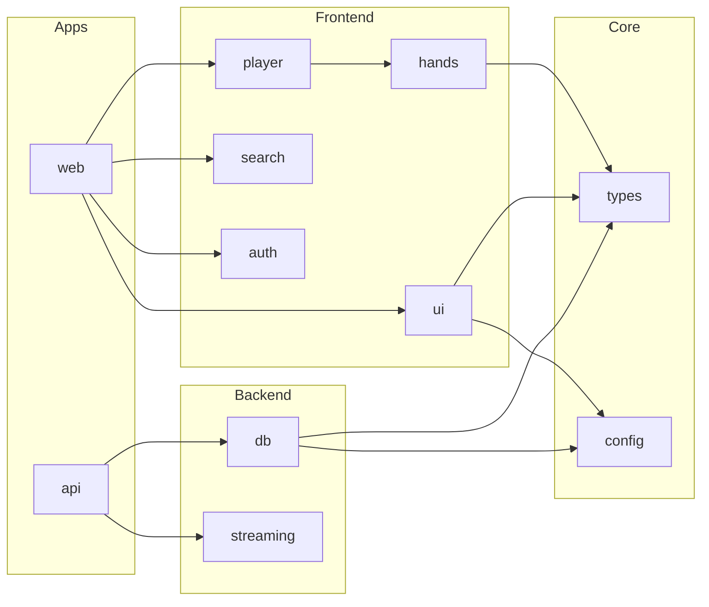

# LLD: WSOPTV Platform (Master)

**Version**: 2.0.0 | **Date**: 2025-12-09 | **PRD**: [0001-prd-wsoptv-platform.md](../prds/0001-prd-wsoptv-platform.md)

> 토큰 최적화된 마스터 문서. 상세 구현은 서브 LLD 참조.

---

## 문서 구조

| 문서 | 설명 | 링크 |
|------|------|------|
| **Master** | 전체 아키텍처 개요 (현재 문서) | - |
| **Modules** | 패키지별 상세 인터페이스 | [0002-lld-modules.md](./0002-lld-modules.md) |
| **API** | REST API 전체 스펙 | [0003-lld-api.md](./0003-lld-api.md) |
| **Components** | Svelte 컴포넌트 상세 | [0004-lld-components.md](./0004-lld-components.md) |
| **Flows** | 시퀀스 다이어그램 | [0005-lld-flows.md](./0005-lld-flows.md) |

---

## 1. 시스템 아키텍처

```
┌─────────────────────────────────────────────────────────────┐
│                    WSOPTV Monorepo                           │
├─────────────────────────────────────────────────────────────┤
│  apps/                      │  packages/                     │
│  ├── web (SvelteKit)        │  ├── @wsoptv/types            │
│  └── api (FastAPI)          │  ├── @wsoptv/ui               │
│                              │  ├── @wsoptv/player           │
│                              │  ├── @wsoptv/hands            │
│                              │  ├── @wsoptv/auth             │
│                              │  ├── @wsoptv/search           │
│                              │  ├── @wsoptv/streaming        │
│                              │  ├── @wsoptv/db               │
│                              │  └── @wsoptv/config           │
├─────────────────────────────────────────────────────────────┤
│  Infrastructure (Docker)                                     │
│  PostgreSQL │ MeiliSearch │ Redis │ Transcoder              │
└─────────────────────────────────────────────────────────────┘
```

## 2. 패키지 의존성 그래프



## 3. 핵심 도메인 요약

### 3.1 인증 (Auth)

| 항목 | 내용 |
|------|------|
| 방식 | JWT (HS256) + httpOnly 쿠키 (#1) |
| Access Token | 15분 (prod) / 24시간 (dev) |
| Refresh Token | 7일 (prod) / 30일 (dev) (#12) |
| 비밀번호 | bcrypt, cost=12 (#2) |
| 가입 | username + password → pending 상태 |
| 승인 | Admin 수동 승인 → approved |
| 상태 | `pending` / `approved` / `rejected` / `suspended` |

### 3.2 스트리밍 (Streaming)

| 항목 | 내용 |
|------|------|
| 프로토콜 | HLS (ABR) |
| 품질 | 360p / 480p / 720p / 1080p |
| 전략 | 인기 콘텐츠 프리트랜스코딩 + 온디맨드 |
| 캐시 | Redis (manifest) + 파일시스템 (segments) |

### 3.3 핸드 시스템 (Hands)

| 항목 | 내용 |
|------|------|
| 등급 | S (필수시청) / A (추천) / B (일반) / C (기본) |
| 스킵 | Netflix 스타일 오버레이 버튼 |
| 모드 | 전체 / 핸드만 / 하이라이트 (S,A) |

### 3.4 검색 (Search)

| 항목 | 내용 |
|------|------|
| 엔진 | MeiliSearch |
| 검색 대상 | title, player, tags, catalog |
| 필터 | catalog, player, handGrade, year |
| 패싯 | 카탈로그별, 등급별 카운트 |

## 4. API 엔드포인트 요약

| 그룹 | 엔드포인트 수 | 인증 | 상세 |
|------|-------------|------|------|
| Auth | 5 | 일부 | [0003-lld-api.md#1-auth](./0003-lld-api.md#1-auth) |
| Catalogs | 2 | ✓ | [0003-lld-api.md#catalogs](./0003-lld-api.md#2-catalogs) |
| Contents | 4 | ✓ | [0003-lld-api.md#contents](./0003-lld-api.md#3-contents) |
| Search | 1 | ✓ | [0003-lld-api.md#search](./0003-lld-api.md#4-search) |
| Stream | 1 | ✓ | [0003-lld-api.md#stream](./0003-lld-api.md#5-stream) |
| Progress | 2 | ✓ | [0003-lld-api.md#progress](./0003-lld-api.md#6-progress) |
| Admin | 2 | Admin | [0003-lld-api.md#admin](./0003-lld-api.md#7-admin) |

## 5. 컴포넌트 요약

| 컴포넌트 | 패키지 | 역할 | 상세 |
|----------|--------|------|------|
| `VideoPlayer` | player | HLS 재생 + 핸드 감지 | [0004](./0004-lld-components.md#videoplayer) |
| `SkipButtons` | player | Netflix 스타일 스킵 | [0004](./0004-lld-components.md#skipbuttons) |
| `HandTimeline` | player | 타임라인 마커 | [0004](./0004-lld-components.md#handtimeline) |
| `SearchBar` | search | 자동완성 검색 | [0004](./0004-lld-components.md#searchbar) |
| `ContentCard` | ui | 콘텐츠 카드 | [0004](./0004-lld-components.md#contentcard) |

## 6. 주요 플로우

| 플로우 | 설명 | 상세 |
|--------|------|------|
| 비디오 재생 | 콘텐츠 선택 → HLS 스트리밍 → 핸드 감지 | [0005](./0005-lld-flows.md#1-video-playback) |
| 회원가입/승인 | 가입 → pending → Admin 승인 | [0005](./0005-lld-flows.md#2-auth) |
| 검색 | 쿼리 → MeiliSearch → 결과 | [0005](./0005-lld-flows.md#3-search) |
| 핸드 스킵 | 비핸드 구간 → 버튼 표시 → 다음 핸드 | [0005](./0005-lld-flows.md#4-hand-skip) |

## 7. 에러 코드 요약

> 전체 에러 코드 목록은 [0003-lld-api.md#에러-코드-전체-목록](./0003-lld-api.md#에러-코드-전체-목록) 참조 (#18)

| Category | Codes | HTTP |
|----------|-------|------|
| **Auth** | `AUTH_INVALID_CREDENTIALS`, `AUTH_PENDING_APPROVAL`, `AUTH_TOKEN_EXPIRED` | 401, 403 |
| **Content** | `CONTENT_NOT_FOUND`, `SERIES_NOT_FOUND`, `CATALOG_NOT_FOUND` | 404 |
| **Stream** | `STREAM_NOT_READY`, `STREAM_SOURCE_ERROR`, `STREAM_ACCESS_DENIED` | 503, 500, 403 |
| **Rate Limit** | `RATE_LIMIT_EXCEEDED` | 429 |
| **Validation** | `VALIDATION_ERROR`, `PROGRESS_VERSION_CONFLICT` | 400, 409 |

## 8. 기술 스택

| 레이어 | 기술 |
|--------|------|
| Monorepo | Turborepo + pnpm |
| Frontend | SvelteKit + Tailwind |
| Backend | FastAPI + SQLAlchemy |
| Database | PostgreSQL 16 |
| Search | MeiliSearch 1.6 |
| Cache | Redis 7 |
| Streaming | FFmpeg + HLS |
| Player | Video.js + hls.js |

---

## 변경 이력

| Version | Date | Changes |
|---------|------|---------|
| 1.0.0 | 2025-12-09 | 초기 LLD (단일 문서) |
| 2.0.0 | 2025-12-09 | 마스터 + 서브 문서 분할 |
| 2.1.0 | 2025-12-09 | 보안/성능/로직/스타일 이슈 32건 수정 (#1-#32) |
