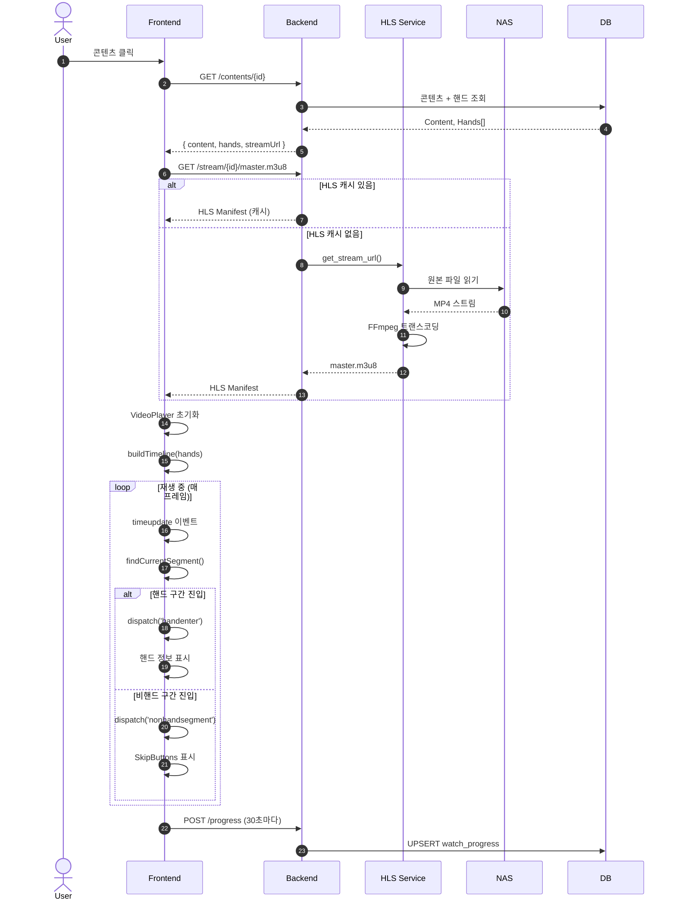
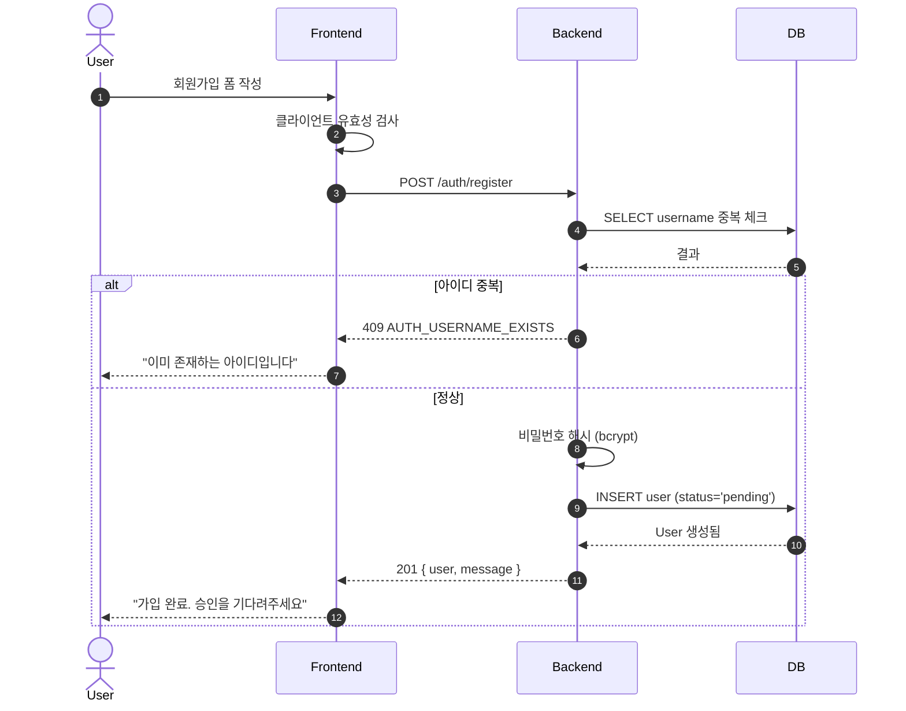
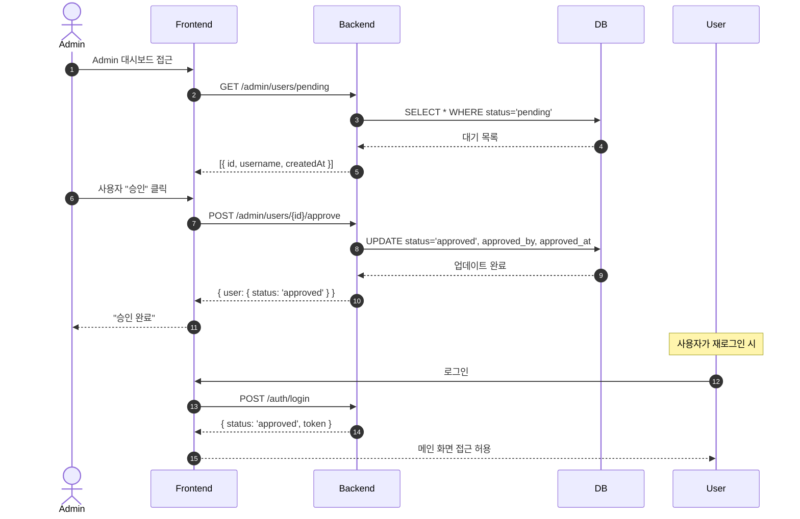
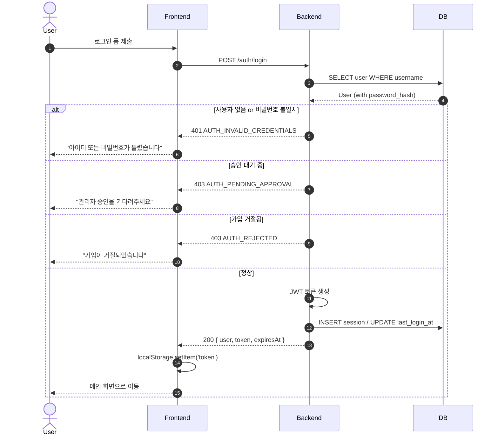
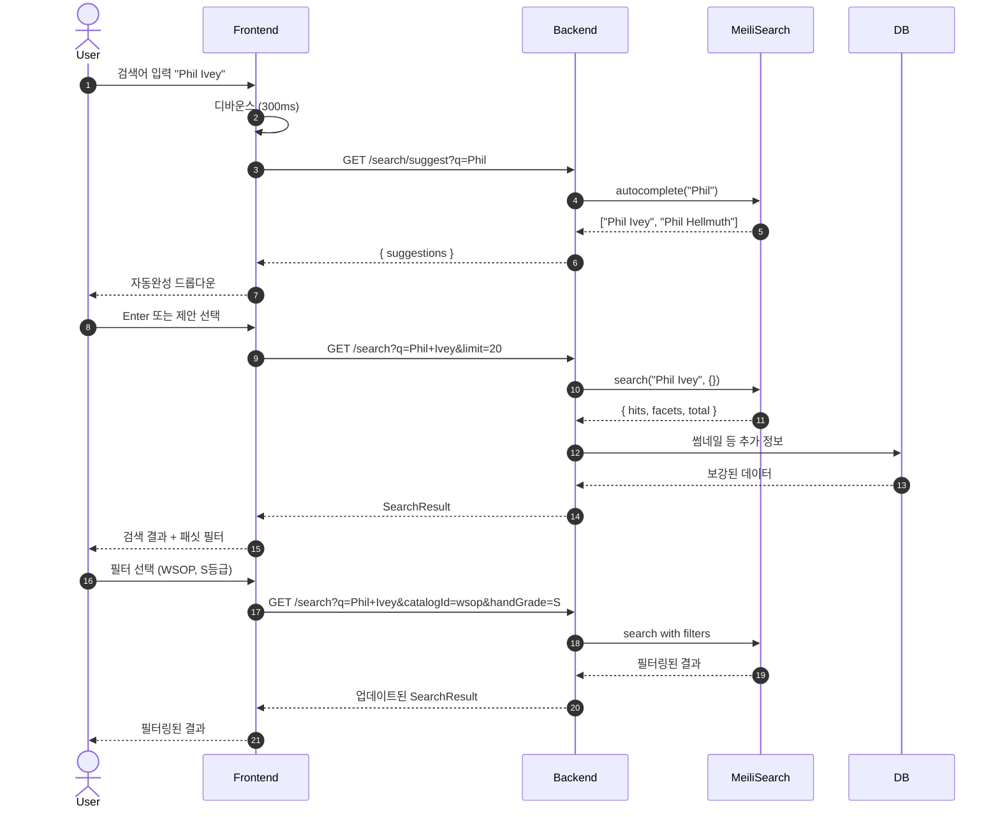
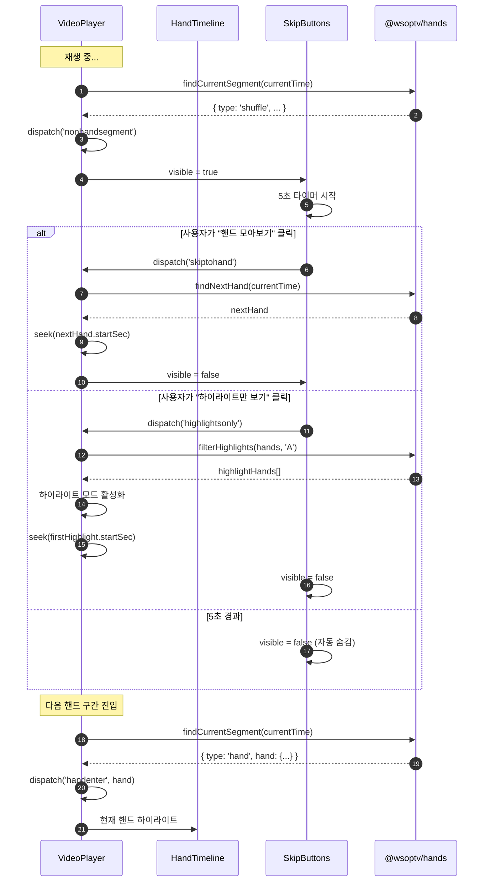
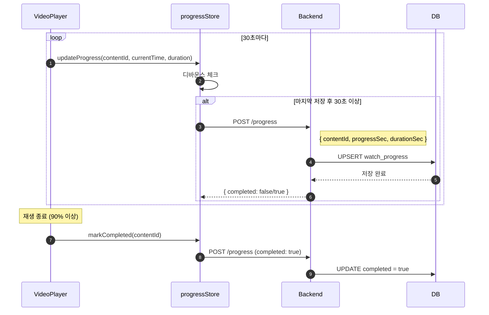
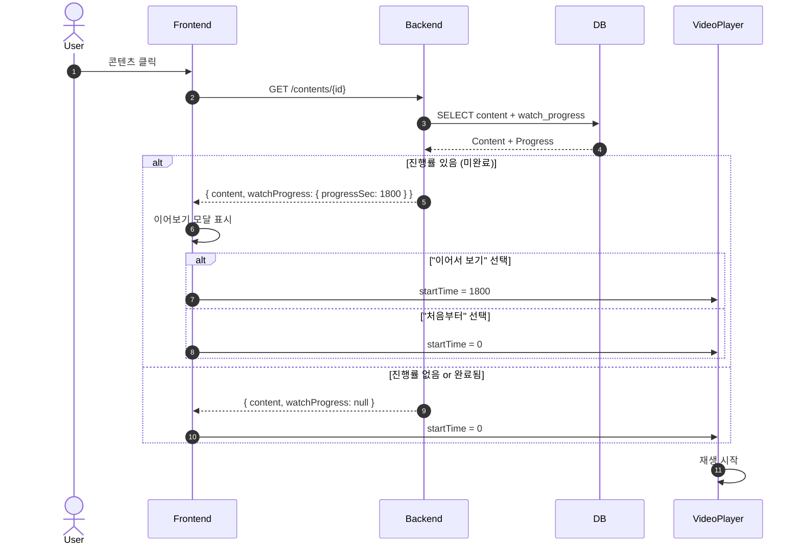
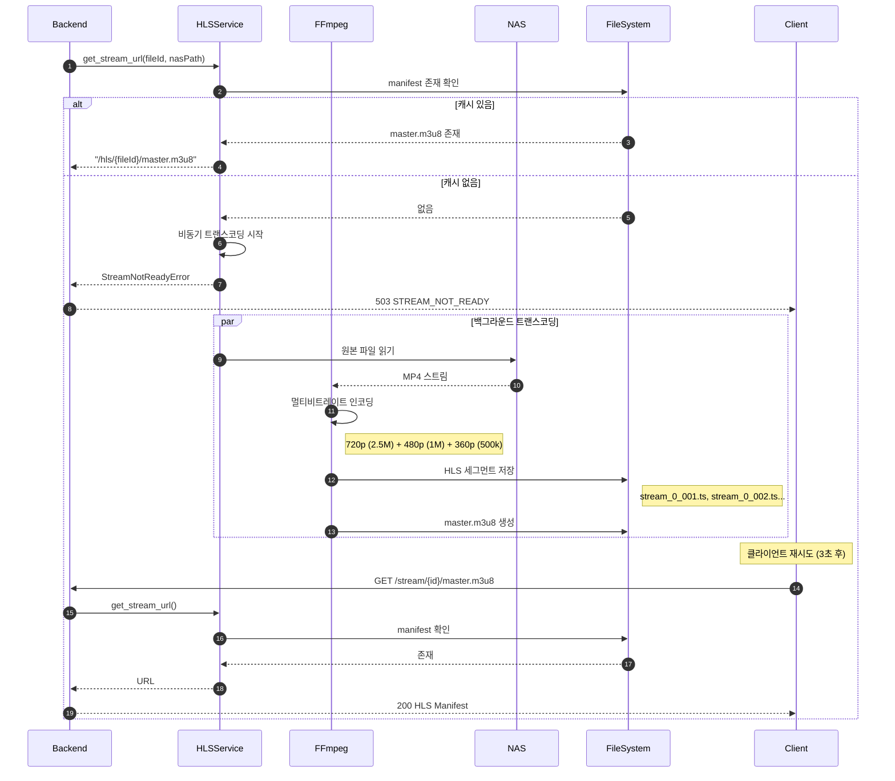
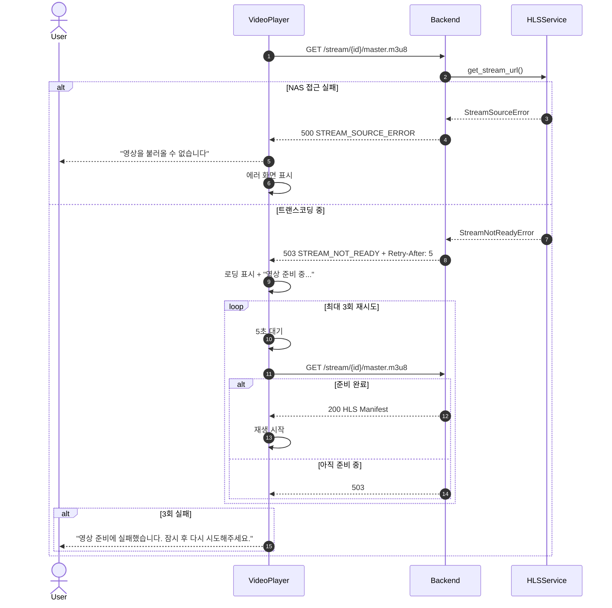

# LLD: Flows (시퀀스 다이어그램)

**Version**: 1.0.0 | **Master**: [0001-lld-wsoptv-platform.md](./0001-lld-wsoptv-platform.md)

---

## 1. Video Playback

콘텐츠 선택 → HLS 스트리밍 → 핸드 감지.

---

## 2. Auth (회원가입/승인)

### 2.1 회원가입

### 2.2 관리자 승인

### 2.3 로그인

---

## 3. Search

검색어 입력 → MeiliSearch → 결과 표시.

---

## 4. Hand Skip

비핸드 구간 진입 → 스킵 버튼 표시 → 다음 핸드로 이동.

---

## 5. Watch Progress Sync

시청 진행률 저장 및 이어보기.

### 5.1 진행률 저장

### 5.2 이어보기

---

## 6. Streaming (HLS 생성)

### 6.1 온디맨드 트랜스코딩

---

## 7. Error Handling

### 7.1 스트리밍 에러 복구

---

## 변경 이력

| Version | Date | Changes |
|---------|------|---------|
| 1.0.0 | 2025-12-09 | 초기 플로우 다이어그램 |
