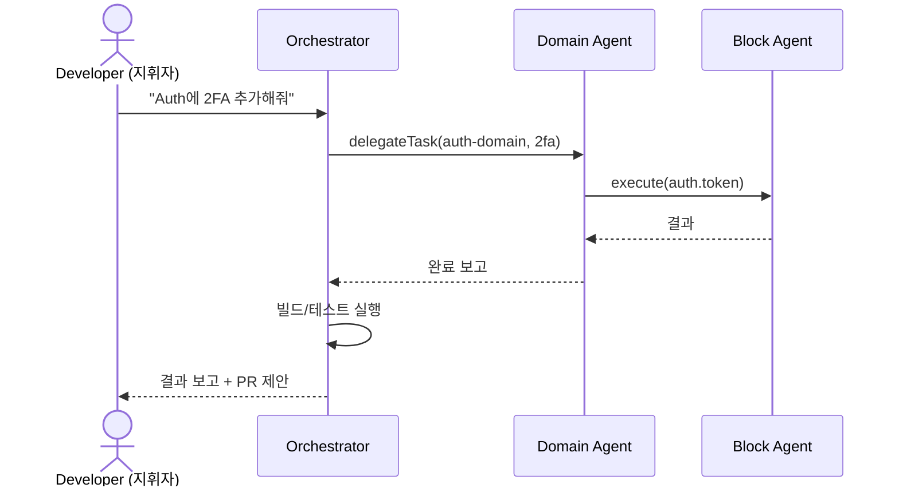
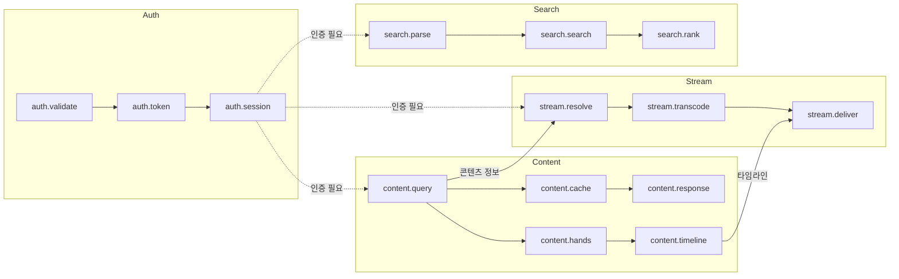

# PRD: Block Agent System - WSOPTV AI 개발 아키텍처

**Version**: 1.0.0
**Date**: 2025-12-09
**Author**: Claude Code
**Status**: Draft
**Architecture**: [0001-block-agent-system.md](../architecture/0001-block-agent-system.md)

---

## 1. Executive Summary

Block Agent System은 WSOPTV 플랫폼 개발 시 AI의 효율성을 극대화하기 위한 **모듈형 에이전트 아키텍처**입니다. 코드베이스를 도메인별 **블럭**으로 분할하고, 각 블럭에 **전담 에이전트**를 배치하여 로직 무결성과 개발 생산성을 동시에 확보합니다.

### 1.1 Vision

> "개발자는 지휘자(Conductor), AI 에이전트 팀이 코드를 작성하는 새로운 개발 패러다임"

### 1.2 Key Differentiators

| 차별점 | 설명 |
|--------|------|
| **AI 컨텍스트 최적화** | 블럭 단위 격리로 환각(Hallucination) 방지 |
| **Vertical Slicing** | 기능형 구조로 Self-Contained 블럭 구성 |
| **Conductor 패러다임** | 개발자 = 지휘자, AI = 실행자 역할 분리 |
| **에러 격리** | 블럭 간 명확한 경계로 부작용(Side Effect) 차단 |

---

## 2. Problem Statement

### 2.1 현재 Pain Points

대규모 코드베이스에서 AI 기반 개발 시 발생하는 문제:

```
┌─────────────────────────────────────────────────────────────┐
│                    AI DEVELOPMENT BOTTLENECKS                │
├─────────────────────────────────────────────────────────────┤
│                                                              │
│  1. Context Pollution (컨텍스트 오염)                        │
│     • 무관한 코드가 AI 추론 방해                             │
│     • 백엔드 작업 시 프론트엔드 코드가 노이즈                 │
│     • 환각(Hallucination) 유발                              │
│                                                              │
│  2. Attention Dilution (주의력 분산)                         │
│     • 1M 토큰 처리 가능해도 집중력 저하                      │
│     • Lost-in-the-Middle 현상                               │
│     • 파일 50개+ 규모에서 성능 급락                          │
│                                                              │
│  3. Error Propagation (에러 전파)                            │
│     • 한 영역 수정이 다른 영역에 영향                        │
│     • 디버깅 범위 불명확                                     │
│     • 회귀 버그 빈발                                         │
│                                                              │
│  4. Inconsistent Quality (품질 불일치)                       │
│     • 동일 작업에 다른 결과                                  │
│     • 코딩 스타일 불일치                                     │
│     • 베스트 프랙티스 미적용                                 │
│                                                              │
└─────────────────────────────────────────────────────────────┘
```

### 2.2 정량적 문제 분석

| 지표 | 현재 (블럭화 없음) | 목표 (블럭화 후) |
|------|-------------------|-----------------|
| AI 응답 시간 | 10초+ | 2~3초 |
| 환각 발생률 | 15~20% | <3% |
| 에러율 | 높음 | 현저히 감소 |
| 컨텍스트 크기 | 500+ 파일 | 15~30 파일 |

### 2.3 Target Users

**Primary**: Claude Code 사용 개발자
- WSOPTV 플랫폼 개발 담당
- AI 기반 코드 생성/수정 작업
- 대규모 코드베이스 관리

**Secondary**: 프로젝트 관리자
- 개발 품질 관리
- 아키텍처 의사결정
- 팀 협업 조정

---

## 3. Solution Overview

### 3.1 High-Level Architecture

```
┌─────────────────────────────────────────────────────────────┐
│                   BLOCK AGENT SYSTEM                         │
├─────────────────────────────────────────────────────────────┤
│                                                              │
│  Level 0: Orchestrator                                       │
│  ┌─────────────────────────────────────────────────────┐    │
│  │                  OrchestratorAgent                   │    │
│  │  • 전체 워크플로우 조정                              │    │
│  │  • 도메인 에이전트 스케줄링                          │    │
│  │  • 글로벌 에러 핸들링                               │    │
│  └─────────────────────────────────────────────────────┘    │
│                            │                                 │
│  Level 1: Domain Agents    │                                 │
│  ┌──────────┬──────────┬──────────┬──────────┐             │
│  │  Auth    │ Content  │  Stream  │  Search  │             │
│  │  Agent   │  Agent   │  Agent   │  Agent   │             │
│  └────┬─────┴────┬─────┴────┬─────┴────┬─────┘             │
│       │          │          │          │                    │
│  Level 2: Block Agents                                       │
│  ┌────┴────┐┌────┴────┐┌────┴────┐┌────┴────┐             │
│  │validate ││ query   ││transcode││ parse   │             │
│  │ token   ││ cache   ││ deliver ││ search  │             │
│  │session  ││ hands   ││ monitor ││ rank    │             │
│  └─────────┘└─────────┘└─────────┘└─────────┘             │
│                                                              │
└─────────────────────────────────────────────────────────────┘
```

### 3.2 Vertical Slicing 구조

기존 계층형에서 기능형으로 전환:

```
Before (계층형)                 After (기능형)
────────────────────           ────────────────────
apps/web/                      apps/web/
├── components/                ├── features/
│   ├── VideoPlayer.svelte     │   ├── auth/
│   ├── SearchBar.svelte       │   │   ├── components/
│   └── AuthForm.svelte        │   │   ├── hooks/
├── hooks/                     │   │   ├── stores/
│   ├── usePlayer.ts           │   │   ├── api/
│   ├── useSearch.ts           │   │   ├── types.ts
│   └── useAuth.ts             │   │   ├── index.ts
├── stores/                    │   │   └── AGENT_RULES.md
│   ├── playerStore.ts         │   ├── player/
│   ├── searchStore.ts         │   ├── search/
│   └── authStore.ts           │   └── content/
└── pages/                     └── shared/
```

### 3.3 도메인-블럭 매핑

| Domain | Blocks | 파일 수 | 토큰 | 상태 |
|--------|--------|--------|------|------|
| **Auth** | validate, token, session | 12개 | ~25k | 🟢 |
| **Content** | query, cache, response, hands, timeline | 28개 | ~45k | 🟡 |
| **Stream** | resolve, transcode, deliver, monitor | 18개 | ~35k | 🟢 |
| **Search** | parse, search, rank | 10개 | ~20k | 🟢 |
| **Player** | (UI 블럭) | 22개 | ~40k | 🟢 |

---

## 4. Feature Requirements

### 4.1 Core Features (Must Have)

#### F1. 블럭 정의 시스템
**Priority**: P0

| 기능 | 설명 |
|------|------|
| 블럭 ID 체계 | `{domain}.{name}` 형식 (예: `auth.validate`) |
| 입출력 포트 | 타입 안전한 인터페이스 정의 |
| 의존성 그래프 | 블럭 간 관계 명시 |
| 상태 관리 | `idle`, `processing`, `error`, `disabled` |

```typescript
interface Block {
  id: string;                    // 'auth.validate'
  domain: DomainType;            // 'auth'
  name: string;                  // 'validate'
  version: string;               // SemVer
  status: BlockStatus;
  inputs: InputPort[];
  outputs: OutputPort[];
  metadata: BlockMetadata;
}
```

#### F2. 에이전트 계층 시스템
**Priority**: P0

| 기능 | 설명 |
|------|------|
| Orchestrator Agent | 전역 조정, 워크플로우 관리 |
| Domain Agent | 도메인별 블럭 관리 |
| Block Agent | 단일 블럭 실행 담당 |
| 헬스 체크 | 에이전트 상태 모니터링 |

```typescript
interface Agent {
  id: string;
  level: 'orchestrator' | 'domain' | 'block';
  status: AgentStatus;
  managedBlocks: string[];
  capabilities: Capability[];
  execute(task: Task): Promise<TaskResult>;
}
```

#### F3. Agent Rules 파일 시스템
**Priority**: P0

| 기능 | 설명 |
|------|------|
| 규칙 파일 | `AGENT_RULES.md` 각 블럭별 배치 |
| DO/DON'T 규칙 | 명확한 제약 사항 정의 |
| 의존성 선언 | 내부/외부 의존성 명시 |
| Claude Code 통합 | 자동 규칙 인식 및 적용 |

```markdown
<!-- features/auth/AGENT_RULES.md -->
# Auth Block Agent Rules

## Constraints
### DO
- ✅ 이 폴더 내 파일만 수정
- ✅ Zod 스키마로 입력 검증

### DON'T
- ❌ features/ 외부 파일 수정
- ❌ 전역 상태 직접 접근
```

### 4.2 Advanced Features (Should Have)

#### F4. Conductor 워크플로우
**Priority**: P1

| 기능 | 설명 |
|------|------|
| 3단계 흐름 | 지휘(Orchestration) → 실행(Execution) → 검증(Integration) |
| 작업 분해 | 고수준 지시 → 블럭별 태스크 분해 |
| 결과 통합 | 블럭 결과 수집 및 통합 |
| 자동 검증 | 빌드/테스트 자동 실행 |



#### F5. 오케스트레이션 패턴
**Priority**: P1

| 패턴 | 적용 |
|------|------|
| Hybrid | 전역 Hierarchical + 도메인 내 Pipeline |
| 병렬 처리 | 독립 블럭 동시 실행 |
| 순차 처리 | 의존성 있는 블럭 체인 |

#### F6. 에러 처리 및 복구
**Priority**: P1

| 기능 | 설명 |
|------|------|
| Circuit Breaker | 연속 실패 시 회로 차단 |
| Retry Policy | 지수 백오프 재시도 |
| Fallback | 캐시/기본값 반환 |
| Escalation | 상위 에이전트 위임 |

### 4.3 Enhancement Features (Nice to Have)

#### F7. 블럭 사이즈 모니터링
**Priority**: P2

| 기능 | 설명 |
|------|------|
| 자동 측정 | 파일 수, 토큰 수 자동 계산 |
| 임계값 경고 | 30개 파일 / 50k 토큰 초과 시 알림 |
| 분할 제안 | 과대 블럭 자동 분할 권장 |

#### F8. 메트릭 수집
**Priority**: P2

| 기능 | 설명 |
|------|------|
| 응답 시간 | 블럭별 실행 시간 추적 |
| 에러율 | 블럭별 에러 비율 |
| 사용률 | 에이전트 활용도 |

---

## 5. Technical Requirements

### 5.1 파일 구조

```
packages/
├── types/
│   ├── block.ts              # Block 인터페이스
│   ├── agent.ts              # Agent 인터페이스
│   ├── message.ts            # 메시지 타입
│   └── error.ts              # 에러 타입
│
├── infrastructure/
│   ├── event-bus.ts          # 이벤트 버스
│   ├── circuit-breaker.ts    # 회로 차단기
│   └── metrics.ts            # 메트릭 수집
│
├── agents/
│   ├── orchestrator/
│   │   └── index.ts
│   ├── auth-domain/
│   │   ├── index.ts
│   │   └── blocks/
│   │       ├── validate.ts
│   │       ├── token.ts
│   │       └── session.ts
│   ├── content-domain/
│   │   └── blocks/
│   ├── stream-domain/
│   │   └── blocks/
│   └── search-domain/
│       └── blocks/
│
.claude/
├── agents/
│   ├── orchestrator.md
│   ├── auth-domain.md
│   ├── content-domain.md
│   ├── stream-domain.md
│   └── search-domain.md
│
apps/web/features/
├── auth/
│   └── AGENT_RULES.md
├── player/
│   └── AGENT_RULES.md
├── search/
│   └── AGENT_RULES.md
└── content/
    └── AGENT_RULES.md
```

### 5.2 통신 프로토콜

```typescript
interface AgentMessage {
  id: string;                    // UUID v7
  timestamp: number;
  source: string;                // Agent ID
  target: string;                // Agent ID | 'broadcast'
  type: MessageType;
  payload: unknown;
  correlationId: string;         // 요청-응답 연결
  traceId: string;               // 분산 추적
  priority: Priority;
  ttl: number;
}

type MessageType =
  | 'task.request'
  | 'task.response'
  | 'task.error'
  | 'status.update';
```

### 5.3 블럭 사이즈 기준

| 구분 | 권장 | 경고 | 위험 |
|------|------|------|------|
| 파일 수 | 15~20개 | 20~30개 | 30개+ |
| 토큰 수 | 25k~35k | 35k~50k | 50k+ |
| AI 응답 시간 | <3초 | 3~10초 | 10초+ |

### 5.4 에러 코드 체계

| Category | Codes | 복구 전략 |
|----------|-------|----------|
| **Block** | `BLOCK_TIMEOUT`, `BLOCK_UNAVAILABLE` | retry → circuit_break |
| **Agent** | `AGENT_OVERLOADED`, `AGENT_COMMUNICATION_FAILED` | escalate |
| **Domain** | `AUTH_FAILED`, `CONTENT_NOT_FOUND` | fallback |

---

## 6. WSOPTV 도메인 매핑

### 6.1 도메인별 블럭 상세

#### Auth Domain

```
┌─────────────────────────────────────────────────────────────┐
│                     AUTH DOMAIN                              │
├─────────────────────────────────────────────────────────────┤
│  ┌──────────────┐    ┌──────────────┐    ┌──────────────┐  │
│  │   validate   │───▶│    token     │───▶│   session    │  │
│  │    Block     │    │    Block     │    │    Block     │  │
│  └──────────────┘    └──────────────┘    └──────────────┘  │
│         │                   │                   │          │
│         ▼                   ▼                   ▼          │
│  • 입력 검증          • JWT 발급           • 세션 관리     │
│  • Zod 스키마         • Refresh 처리       • Redis 저장    │
│  • Rate Limit         • Blacklist          • 만료 처리     │
└─────────────────────────────────────────────────────────────┘
```

#### Content Domain

```
┌─────────────────────────────────────────────────────────────┐
│                    CONTENT DOMAIN                            │
├─────────────────────────────────────────────────────────────┤
│  ┌──────────────┐    ┌──────────────┐    ┌──────────────┐  │
│  │    query     │───▶│    cache     │───▶│   response   │  │
│  │    Block     │    │    Block     │    │    Block     │  │
│  └──────────────┘    └──────────────┘    └──────────────┘  │
│         │                                                   │
│  ┌──────┴───────┐                                          │
│  ▼              ▼                                          │
│  ┌──────────────┐    ┌──────────────┐                      │
│  │    hands     │───▶│   timeline   │                      │
│  │    Block     │    │    Block     │                      │
│  └──────────────┘    └──────────────┘                      │
└─────────────────────────────────────────────────────────────┘
```

#### Stream Domain

```
┌─────────────────────────────────────────────────────────────┐
│                    STREAM DOMAIN                             │
├─────────────────────────────────────────────────────────────┤
│  ┌──────────────┐    ┌──────────────┐    ┌──────────────┐  │
│  │   resolve    │───▶│  transcode   │───▶│   deliver    │  │
│  │    Block     │    │    Block     │    │    Block     │  │
│  └──────────────┘    └──────────────┘    └──────────────┘  │
│                             │                               │
│                      ┌──────┴──────┐                       │
│                      │   monitor   │                       │
│                      │    Block    │                       │
│                      └─────────────┘                       │
└─────────────────────────────────────────────────────────────┘
```

#### Search Domain

```
┌─────────────────────────────────────────────────────────────┐
│                    SEARCH DOMAIN                             │
├─────────────────────────────────────────────────────────────┤
│  ┌──────────────┐    ┌──────────────┐    ┌──────────────┐  │
│  │    parse     │───▶│    search    │───▶│    rank      │  │
│  │    Block     │    │    Block     │    │    Block     │  │
│  └──────────────┘    └──────────────┘    └──────────────┘  │
│         │                   │                   │          │
│         ▼                   ▼                   ▼          │
│  • 쿼리 파싱           • MeiliSearch       • 결과 정렬    │
│  • 필터 추출           • 패싯 집계         • 개인화       │
└─────────────────────────────────────────────────────────────┘
```

### 6.2 도메인 간 의존성



---

## 7. Non-Functional Requirements

### 7.1 Performance

| Metric | Target |
|--------|--------|
| 블럭 실행 시간 | <3초 |
| 에이전트 응답 시간 | <5초 |
| 전체 워크플로우 | <30초 |
| AI 환각률 | <3% |

### 7.2 Reliability

| Metric | Target |
|--------|--------|
| 에이전트 가용성 | 99.9% |
| 에러 복구 성공률 | 95% |
| 회로 차단 후 복구 시간 | <30초 |

### 7.3 Maintainability

| Metric | Target |
|--------|--------|
| 새 블럭 추가 시간 | <30분 |
| 규칙 파일 업데이트 | 즉시 적용 |
| 의존성 변경 영향 분석 | 자동화 |

---

## 8. Development Phases

### Phase 1: Foundation (필수 기반)

**목표**: 블럭/에이전트 타입 시스템 및 기본 구조

| 작업 | 우선순위 |
|------|----------|
| Block/Agent 타입 정의 | P0 |
| 도메인별 블럭 식별 및 정의 | P0 |
| Vertical Slicing 폴더 구조 전환 | P0 |
| Agent Rules 템플릿 작성 | P0 |
| 기본 Event Bus 구현 | P0 |

### Phase 2: Integration (통합)

**목표**: Claude Code 통합 및 Conductor 워크플로우

| 작업 | 우선순위 |
|------|----------|
| Claude Code 규칙 인식 설정 | P1 |
| Orchestrator Agent 구현 | P1 |
| Domain Agent 구현 (4개) | P1 |
| Conductor 3단계 워크플로우 | P1 |
| Circuit Breaker 구현 | P1 |

### Phase 3: Enhancement (고도화)

**목표**: 모니터링 및 자동화

| 작업 | 우선순위 |
|------|----------|
| 블럭 사이즈 자동 측정 | P2 |
| 메트릭 대시보드 | P2 |
| 자동 분할 제안 | P2 |
| 성능 최적화 | P2 |

---

## 9. Success Metrics

### 9.1 개발 생산성

| Metric | Target |
|--------|--------|
| AI 코드 생성 정확도 | 95%+ |
| 코드 리뷰 통과율 | 90%+ |
| 회귀 버그 발생률 | <5% |
| 평균 태스크 완료 시간 | 50% 감소 |

### 9.2 코드 품질

| Metric | Target |
|--------|--------|
| 테스트 커버리지 | 80%+ |
| 린트 통과율 | 100% |
| 타입 안전성 | 100% |
| 순환 의존성 | 0개 |

### 9.3 AI 효율성

| Metric | Target |
|--------|--------|
| 컨텍스트 크기 감소 | 80%+ (500→30 파일) |
| 환각 발생률 | <3% |
| 응답 시간 단축 | 70%+ (10초→3초) |

---

## 10. Risks & Mitigations

| Risk | Probability | Impact | Mitigation |
|------|-------------|--------|------------|
| 초기 구조 전환 비용 | High | Medium | 점진적 마이그레이션, 기존 코드 유지 |
| 블럭 경계 설정 어려움 | Medium | Medium | SRP 원칙 준수, 반복 개선 |
| Claude Code 통합 이슈 | Low | High | 수동 규칙 적용 대안 |
| 과도한 추상화 | Medium | Medium | YAGNI 원칙, 필요시만 확장 |

---

## 11. Appendix

### 11.1 Agent Rules 템플릿

```markdown
# {Domain} Block Agent Rules

## Identity
- **Role**: {역할 설명}
- **Domain**: {도메인명}
- **Scope**: `features/{domain}/` 내부만

## Constraints

### DO (해야 할 것)
- ✅ 이 폴더 내 파일만 수정
- ✅ `types.ts`의 타입 정의 우선 확인
- ✅ `index.ts`를 통해 외부 노출 API 관리
- ✅ Zod 스키마로 입력 검증

### DON'T (하지 말 것)
- ❌ `features/` 외부 파일 직접 수정
- ❌ `shared/ui` 컴포넌트 내부 수정
- ❌ 전역 상태 직접 접근
- ❌ 하드코딩된 비밀값 사용

## Dependencies

### 내부 의존성
- `@wsoptv/types`: 공유 타입

### 외부 의존성
- (라이브러리 목록)

## Testing
- 단위 테스트: `__tests__/` 폴더
- Mock: (Mock 정책)

## Error Codes
- (에러 코드 목록)
```

### 11.2 지휘 명령 예시

| 지휘 명령 | 라우팅 | 실행 블럭 |
|----------|--------|----------|
| "인증 로직에 2FA 추가해줘" | auth-domain | auth.token, auth.session |
| "검색 결과 정렬 방식 변경해줘" | search-domain | search.rank |
| "스트리밍 품질 옵션 추가해줘" | stream-domain | stream.transcode, stream.deliver |
| "핸드 스킵 기능 구현해줘" | content-domain + player | content.timeline, player |

### 11.3 관련 문서

| 문서 | 설명 |
|------|------|
| [Architecture](../architecture/0001-block-agent-system.md) | 상세 아키텍처 설계 |
| [LLD Modules](../lld/0002-lld-modules.md) | 모듈별 상세 인터페이스 |
| [Platform PRD](./0001-prd-wsoptv-platform.md) | WSOPTV 플랫폼 PRD |

---

**Document History**

| Version | Date | Author | Changes |
|---------|------|--------|---------|
| 1.0.0 | 2025-12-09 | Claude Code | Initial draft |

---

**Next Steps**: Architecture 문서 기반 구현 시작
