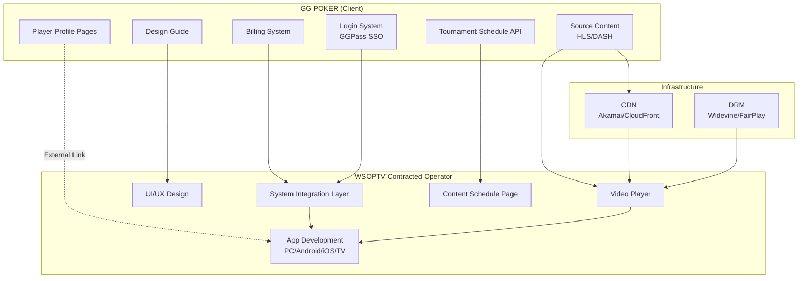
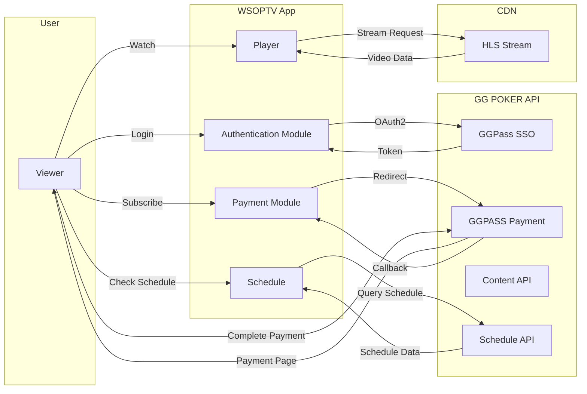
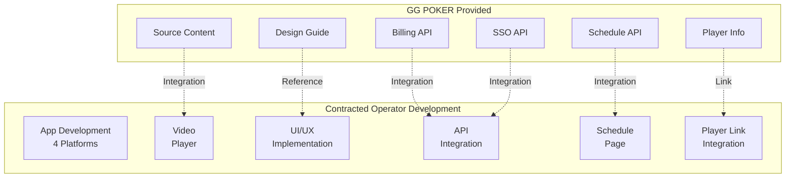

# PRD-0005: WSOP TV OTT Solution RFP

| Item | Value |
|------|-------|
| **Version** | 1.1 |
| **Status** | Draft |
| **Priority** | P0 |
| **Created** | 2026-01-08 |
| **Author** | Claude Code |
| **Type** | RFP (Request for Proposal) |

---

## Executive Summary

This is a Request for Proposal (RFP) for establishing an official WSOP (World Series of Poker) OTT streaming platform through a contracted operator. This document defines the division of responsibilities, functional requirements, and integration interfaces between GG POKER (Client) and the contracted operator.

### Project Overview

| Item | Description |
|------|-------------|
| **Project Name** | WSOP TV OTT Platform Development |
| **Client** | GG POKER |
| **Target Platforms** | PC Web, Android, iOS, Samsung TV, LG TV |
| **Proposal Scope** | App Development, Player Development, UI Implementation, System Integration |

---

## 1. Responsibility Matrix

### 1.1 GG POKER (Client) Provided Items

GG POKER will provide the following items to the contracted operator:

| # | Provided Item | Description | Format |
|:-:|---------------|-------------|--------|
| 1 | **Design Guide** | Brand guidelines, UI component specs | Documents/Figma |
| 2 | **Billing System** | Payment/subscription API endpoints | REST API |
| 3 | **Login System** | GGPass SSO OAuth2 integration API | OAuth2 Spec |
| 4 | **Source Content** | VOD/Live content stream sources | HLS/DASH URL |
| 5 | **Tournament Schedule Data** | Tournament schedule API or data feed | REST API |
| 6 | **Player Profile Pages** | WSOP.com player profile links | URL |

### 1.2 Contracted Operator Development Scope

The contracted operator shall develop the following items:

| # | Development Item | Platform | Description |
|:-:|------------------|----------|-------------|
| 1 | **WSOPTV App Development** | PC/Android/iOS/TV | Cross-platform OTT application |
| 2 | **Video Player Development** | Common | Custom player development |
| 3 | **Design Implementation** | Common | UI implementation based on GG POKER guidelines |
| 4 | **Billing System Integration** | Common | GG POKER billing API integration |
| 5 | **Login System Integration** | Common | GGPass SSO integration |
| 6 | **Source Content Integration** | Common | Content stream pipeline |
| 7 | **Content Schedule Page** | Common | Tournament schedule display page development |
| 8 | **Player Profile Link Integration** | Common | External page integration |

---

## 2. System Architecture

### 2.1 Overall System Integration Structure



### 2.2 Data Flow Diagram



### 2.3 Responsibility Matrix Diagram



---

## 3. Functional Requirements

### 3.1 Platform-Specific Required Features

| Platform | Live | VOD | Multi-View | Subtitles | DRM | Notes |
|----------|:----:|:---:|:----------:|:---------:|:---:|-------|
| **PC Web** | O | O | O | O | O | Browser DRM support required |
| **Android** | O | O | O | O | O | - |
| **iOS** | O | O | O | O | O | - |
| **Samsung TV** | O | O | X | O | O | Multi-view not supported (remote control UX constraints) |
| **LG TV** | O | O | X | O | O | Multi-view not supported (remote control UX constraints) |

### 3.2 Core Feature Details

#### 3.2.1 Live Streaming
| Requirement | Details |
|-------------|---------|
| Quality | 1080p Full HD |
| Protocol | HLS-based |
| Latency | 30 min - 1 hour intentional delay (spoiler prevention) |
| Concurrent Users | Support for 500,000 users |

#### 3.2.2 VOD & Quick VOD
| Requirement | Details |
|-------------|---------|
| Quick VOD | Immediate transition from Live to VOD |
| Resume Playback | Viewing history and resume support |
| Chapters | Segment navigation support |

#### 3.2.3 Multi Video Player (Web/Mobile Only)
| Requirement | Details |
|-------------|---------|
| Feature | Multiple camera source streaming and selection during live broadcast |
| Display Mode | Multi-view (4-way simultaneous playback) or single screen selection |
| Camera Sources | Multiple camera angles provided (sources TBD) |
| Audio | Per-source selection available |
| UI | Thumbnail preview, screen switching |
| Platform | PC Web, Android, iOS (TV not supported - remote control UX constraints) |

#### 3.2.4 Subtitles
| Requirement | Details |
|-------------|---------|
| Languages | 20 language subtitle support |
| Base Language | English-based translation |
| Priority | VOD subtitle support prioritized |

### 3.3 Non-Functional Requirements

#### 3.3.1 Performance
| Item | Target |
|------|--------|
| Concurrent Users | 500,000 users |
| Initial Buffering | < 3 seconds |
| Rebuffering Rate | < 1% |

#### 3.3.2 Security
| Item | Requirement |
|------|-------------|
| DRM | Widevine, FairPlay, PlayReady |
| VPN Detection | 80-90% accuracy |
| Blackout | Country-specific support |

#### 3.3.3 Availability
| Item | Target |
|------|--------|
| SLA | 99.9% |
| CDN | Multi-CDN configuration recommended |

---

## 4. Integration Interfaces

### 4.1 GG POKER Provided APIs

| Integration Item | Provided Format | Operator Implementation |
|------------------|-----------------|-------------------------|
| **Billing** | REST API endpoints | API client implementation |
| **Login** | OAuth2 SSO specification | SSO integration module development |
| **Content** | HLS/DASH stream URLs | Player integration |
| **Schedule** | REST API | Schedule display UI development |
| **Player Info** | External URLs | Link integration |

### 4.2 Integration Details

#### 4.2.1 GGPass SSO Integration
```
Authentication Flow: OAuth2 Authorization Code Flow
- Authorization Endpoint: Provided by GG POKER
- Token Endpoint: Provided by GG POKER
- User Info Endpoint: Provided by GG POKER
```

#### 4.2.2 Payment System Integration (GGPASS)

##### Payment Processing Method
| Item | Description |
|------|-------------|
| Payment Module | GGPASS sub-module payment system |
| Integration Method | Separate payment page call (Redirect) |
| Authentication Link | Utilizes GGPass SSO login session |

##### Payment Flow
```
1. User → Clicks subscription button in WSOPTV app
2. WSOPTV → Redirects to GGPASS payment page
3. User → Completes payment on GGPASS
4. GGPASS → Sends payment result callback to WSOPTV
5. WSOPTV → Updates subscription status
```

##### API Features
```
- Subscription status inquiry
- Payment result callback reception (webhook)
- Subscription plan inquiry
```

#### 4.2.3 Content Source Integration
```
Stream Format: HLS (.m3u8) / DASH (.mpd)
DRM: Widevine, FairPlay, PlayReady license server provided
```

#### 4.2.4 Schedule API Integration
```
Data Format: JSON
Refresh Interval: Real-time or 5-minute cache
```

---

## 5. Proposal Request Items

Proposers must include the following items in their proposals:

### 5.1 Technical Proposal

| Proposal Item | Evaluation Criteria |
|---------------|---------------------|
| Architecture Design | Scalability, stability, maintainability |
| Technology Stack Selection Rationale | Suitability, currency, ecosystem |
| Performance Goals and Achievement Methods | Support for 500,000 concurrent users |
| Security Design | DRM, authentication, data protection |
| Infrastructure Configuration | CDN, servers, monitoring |

### 5.2 Deliverables Proposal

| Proposal Item | Evaluation Criteria |
|---------------|---------------------|
| Development Deliverables List | Completeness, acceptance feasibility |
| Documentation Scope | Sufficiency for operations handover |
| Test Plan | Quality assurance approach |
| Operations Handover Plan | Sufficiency of knowledge transfer |

### 5.3 Schedule Proposal

| Proposal Item | Evaluation Criteria |
|---------------|---------------------|
| Milestone Definition | Clarity, measurability |
| Detailed Schedule | Feasibility |
| Risk Management Plan | Appropriateness of countermeasures |

### 5.4 Cost Proposal

| Proposal Item | Evaluation Criteria |
|---------------|---------------------|
| Detailed Cost Breakdown | Appropriateness, transparency |
| Cost Estimation Rationale | Reasonableness |
| Additional Cost Conditions | Clarity |

---

## 6. Proposal Evaluation Criteria

| Evaluation Item | Weight |
|-----------------|:------:|
| Technical Capability and Architecture | 30% |
| Similar Project Experience | 20% |
| Development Schedule and Resources | 20% |
| Cost Appropriateness | 20% |
| Maintenance and Support Plan | 10% |

---

## 7. Proposal Schedule

| Phase | Description | Notes |
|-------|-------------|-------|
| RFP Distribution | Request for Proposal delivery | - |
| Q&A | Proposer inquiries received | Written inquiries |
| Proposal Submission | Proposal deadline | - |
| Technical Evaluation | Proposal review | - |
| Presentation | Proposal presentation | If required |
| Preferred Bidder Selection | Final vendor selection | - |
| Contract Execution | Contract completion | - |

---

## 8. Additional Information

### 8.1 Out of Scope

| Item | Reason |
|------|--------|
| 4K Support | To be considered in Phase 2 |
| Roku/Fire TV | To be considered in Phase 2 |
| News Section | Not required |
| Player Stats/Details | Replaced with WSOP.com link |
| Ticketing | Online subscription only |

### 8.2 Reference Documents

- PRD-0001: WSOPTV Vendor Selection Guide
- PRD-0002: WSOPTV OTT Platform MVP

---

## Revision History

| Version | Date | Author | Description |
|---------|------|--------|-------------|
| 1.0 | 2026-01-08 | Claude Code | Initial creation |
| 1.0-EN | 2026-01-09 | Claude Code | English translation |
| 1.1 | 2026-01-09 | Claude Code | Multi Video Player feature expansion, GGPASS payment integration details |
